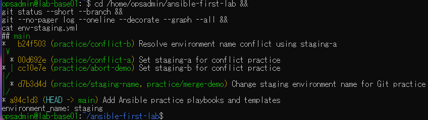
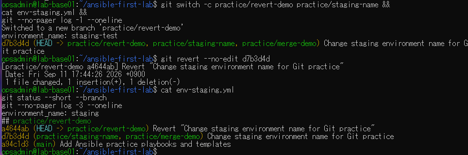
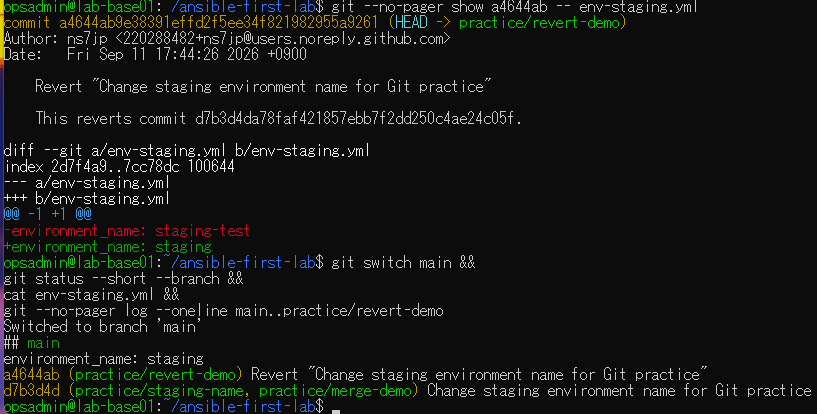

# lab-base01：revert演習の原画像

[結果票へ戻る](../../2026-09-11-lab-base01-git-revert-practice.md)

本人提供の原画像3枚を無加工で保存。ユーザー名・ホスト名・演習パス・Git author名と
noreplyメールアドレス・コミット日時・SHAを含む。秘密鍵本文・パスワードは含まない。
ハッシュはコピー一致の確認用で、実施主体や撮影日時の第三者認証ではない。

[元ファイル名・サイズ・SHA-256](manifest.json) / [SHA256SUMS](SHA256SUMS.txt)

## E01 mainの開始状態と履歴

## E02 練習ブランチ作成・revert・本文と履歴

## E03 逆向きの差分・main復帰・履歴保持

