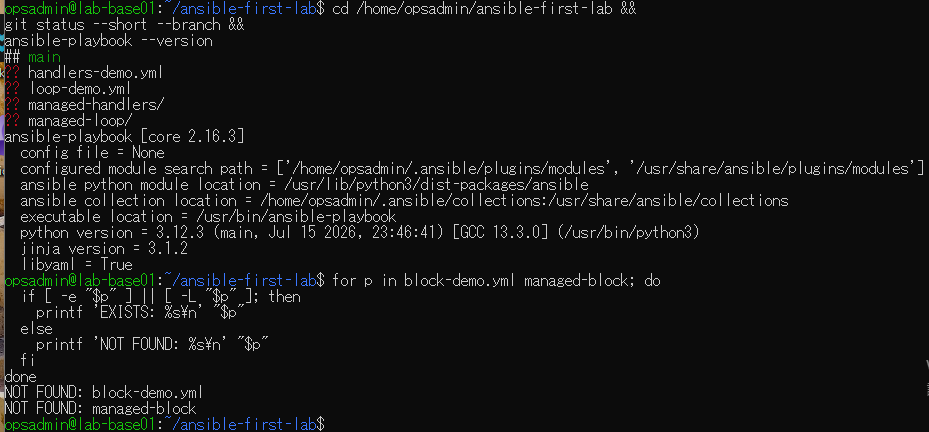
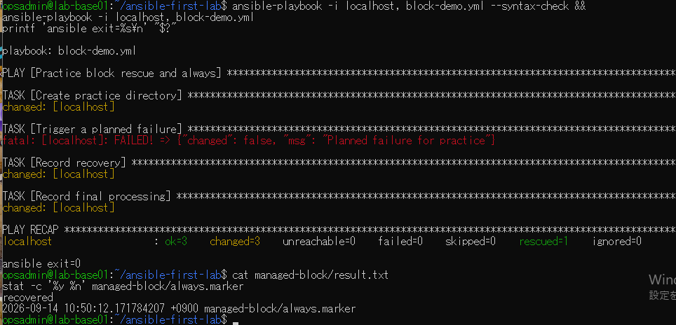
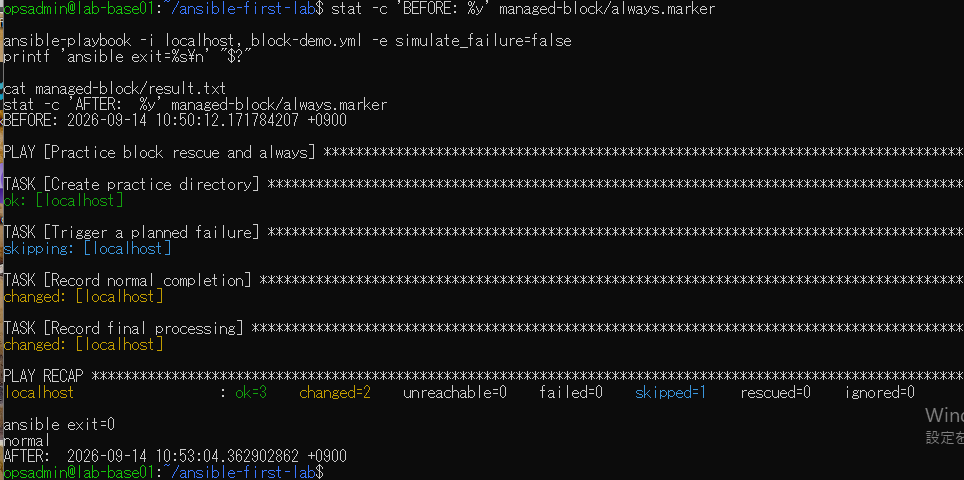
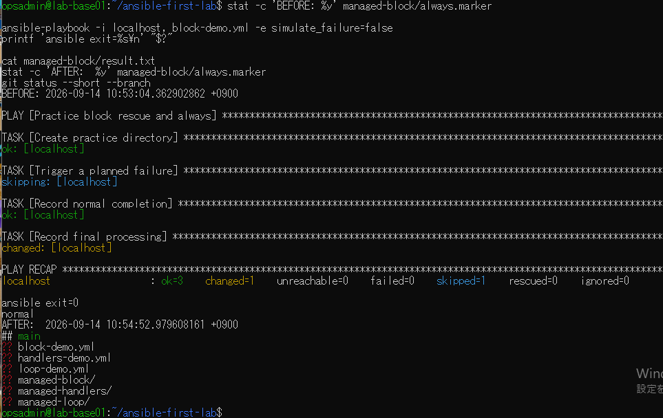

# lab-base01：block演習の原画像

[結果票](../../practice/2026-09-14-lab-base01-block-practice.md)

本人提供の原画像4枚を無加工で保存。ユーザー名・ホスト名・パス・ソフトウェア版・更新日時・Git状態を含む。
秘密鍵本文やパスワードは含まない。ハッシュはコピー一致確認用で、主体や撮影日時の第三者認証ではない。

[元画像名・サイズ・SHA-256](manifest.json) / [SHA256SUMS](SHA256SUMS.txt)

## E01 開始状態と版情報

## E02 意図的失敗とrescue・always

## E03 正常条件への切替

## E04 正常再実行と最終Git状態

