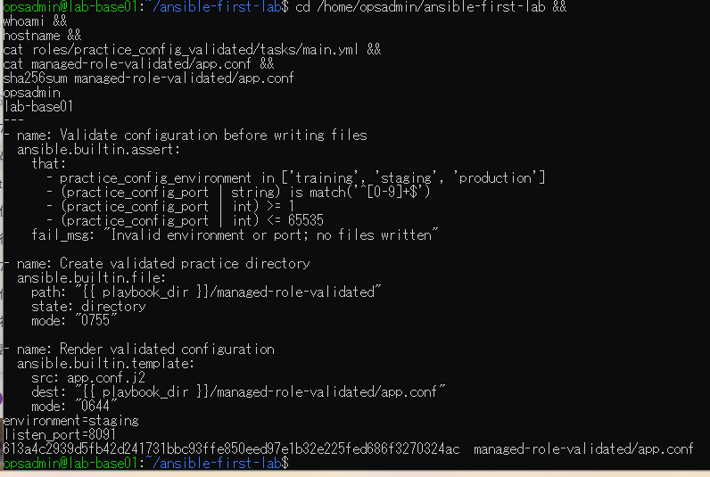
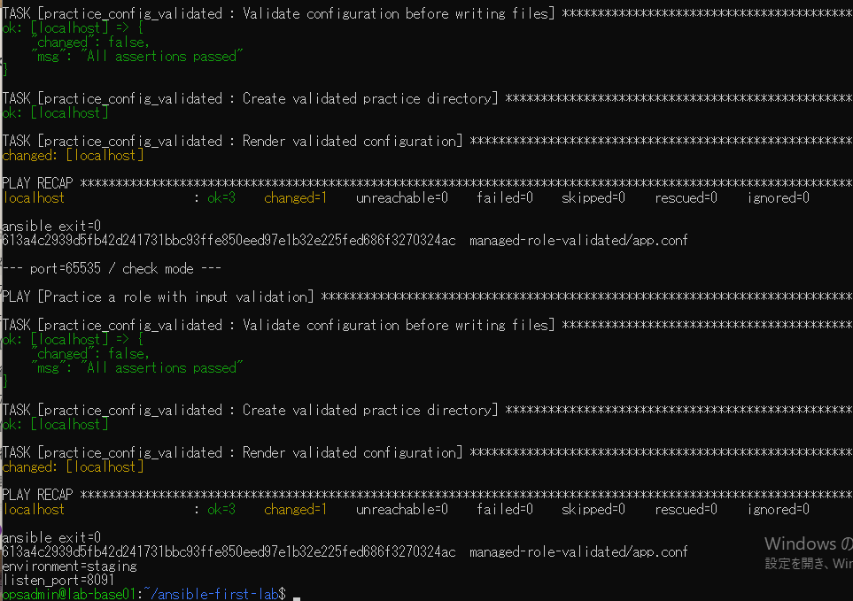
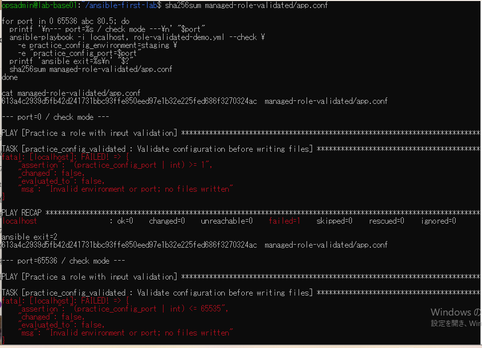
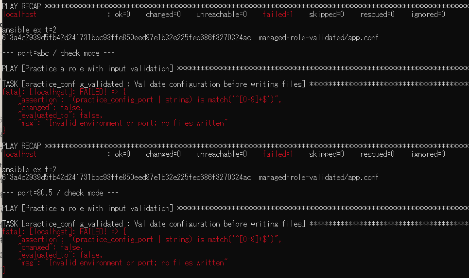
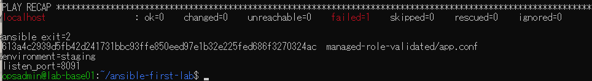
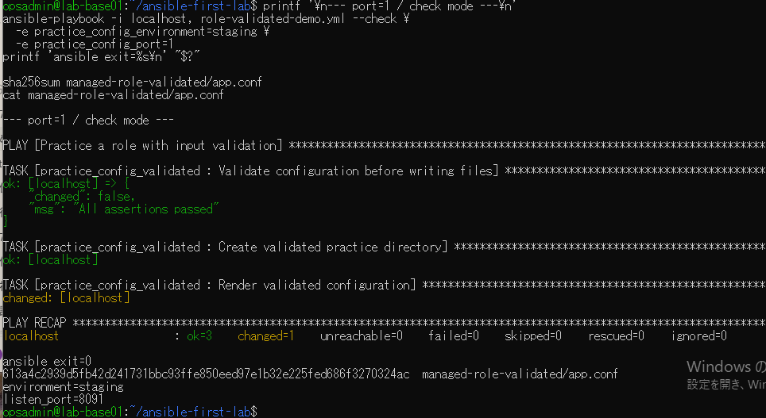

# lab-base01：境界値演習の原画像

[結果票](../../practice/2026-09-14-lab-base01-boundary-practice.md)

本人提供画像6枚を無加工で保存。ユーザー名・ホスト名・演習パス・設定本文・SHA-256を含む。
秘密鍵本文やパスワードは含まない。画像ハッシュはコピー一致確認用で、主体や日時の第三者認証ではない。
E03〜E05は同一の4入力ループの出力を分割した画面。E02上部は入力見出しが画面外のため下限の証拠にしない。

[元画像名・サイズ・SHA-256](manifest.json) / [SHA256SUMS](SHA256SUMS.txt)

## E01 検証処理と開始時の本文・ハッシュ

## E02 上限65535の受入

## E03 0と65536の範囲外拒否

## E04 abcと80.5の形式拒否

## E05 最後の拒否結果と本文維持

## E06 下限1の再採録と本文維持

