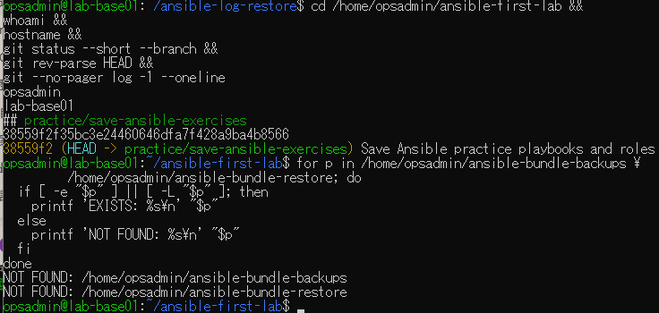
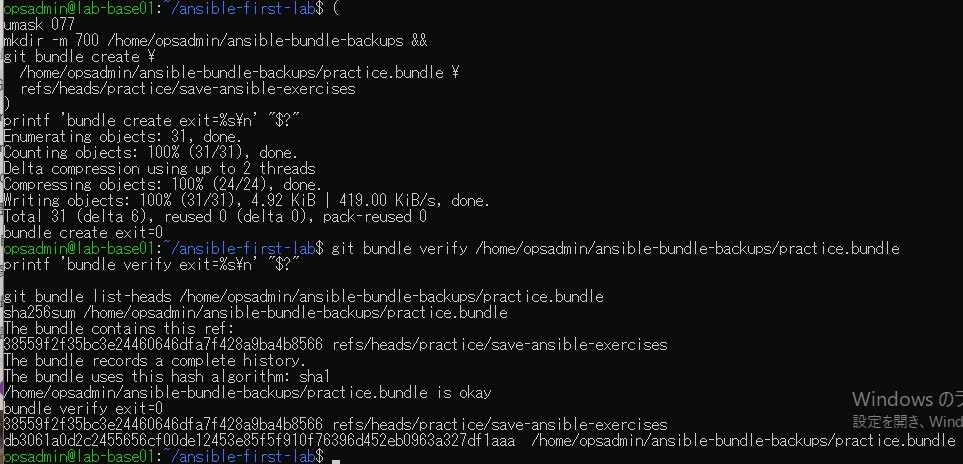
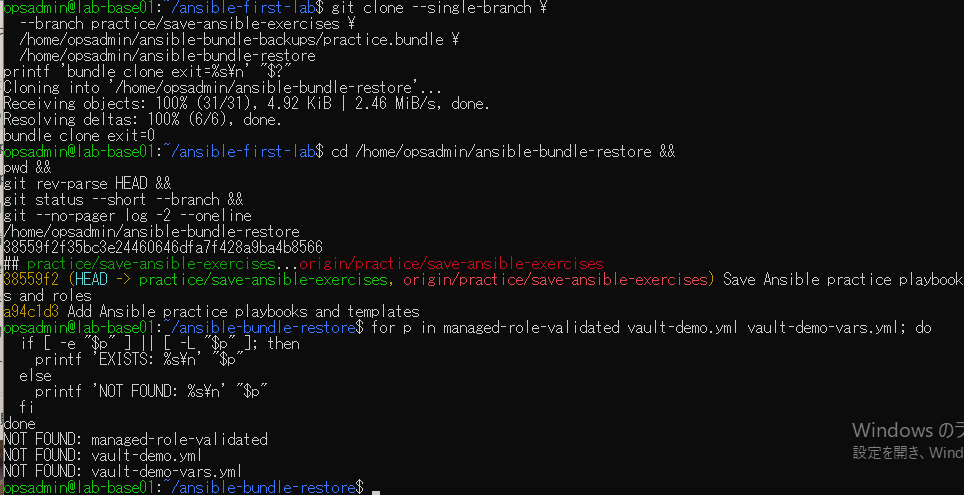
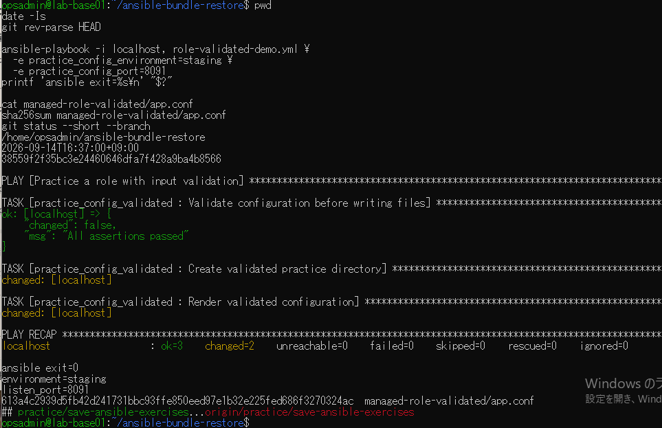
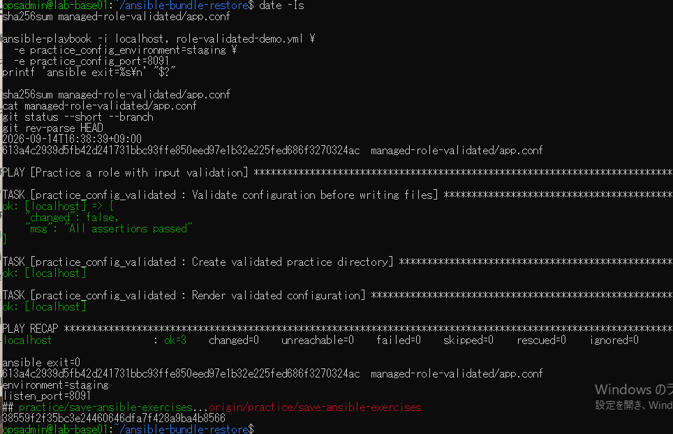

# lab-base01：bundle復元の原画像

[結果票](../../2026-09-14-lab-base01-bundle-practice.md)

本人提供画像5枚を無加工で保存。ユーザー名・ホスト名・パス・日時・Git状態・SHA・設定本文を含む。
Vaultファイル名は表示されるが、秘密鍵本文・パスワード・Vault暗号文は含まない。bundle実体は公開しない。
画像ハッシュはコピー一致確認で、主体や日時の第三者認証ではない。

[元画像名・サイズ・SHA-256](manifest.json) / [SHA256SUMS](SHA256SUMS.txt)

## E01 開始状態と保存先・復元先未使用

## E02 bundle作成・検査・収録ref

## E03 bundleからclone・生成物不在

## E04 復元ソースで新規生成

## E05 同条件再実行と最終状態

