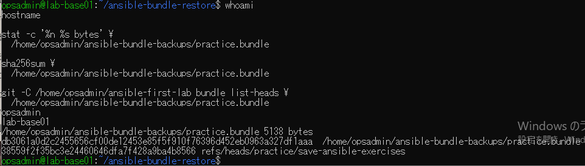
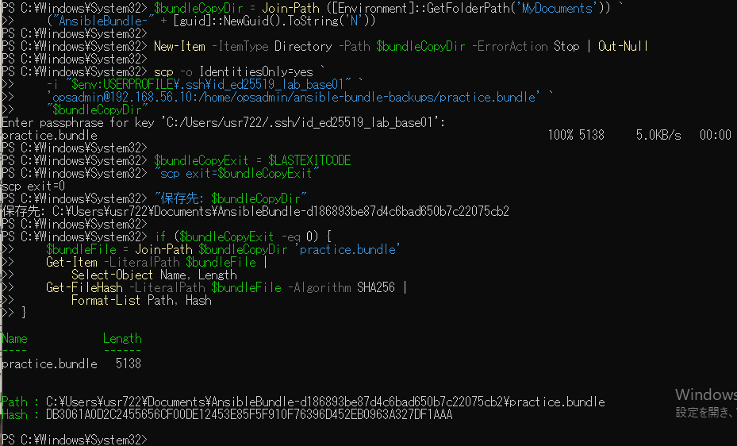

# lab-base01：bundle転送の原画像

[結果票](../../2026-09-14-lab-base01-bundle-transfer-practice.md)

本人提供画像2枚を無加工で保存。ユーザー名・ホスト名・プライベートIP・SSH鍵パス・Windows保存先・SHAを含む。
秘密鍵本文や入力パスフレーズは表示されていない。bundle実体は添付しない。
画像ハッシュはコピー一致確認用で、主体や日時の第三者認証ではない。

[元画像名・サイズ・SHA-256](manifest.json) / [SHA256SUMS](SHA256SUMS.txt)

## E01 VM側bundleのサイズ・ハッシュ・ref

## E02 Windows転送と一致確認

