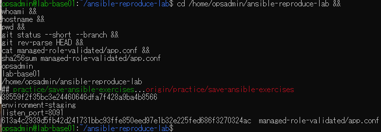
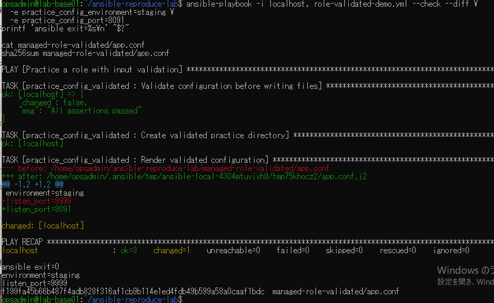
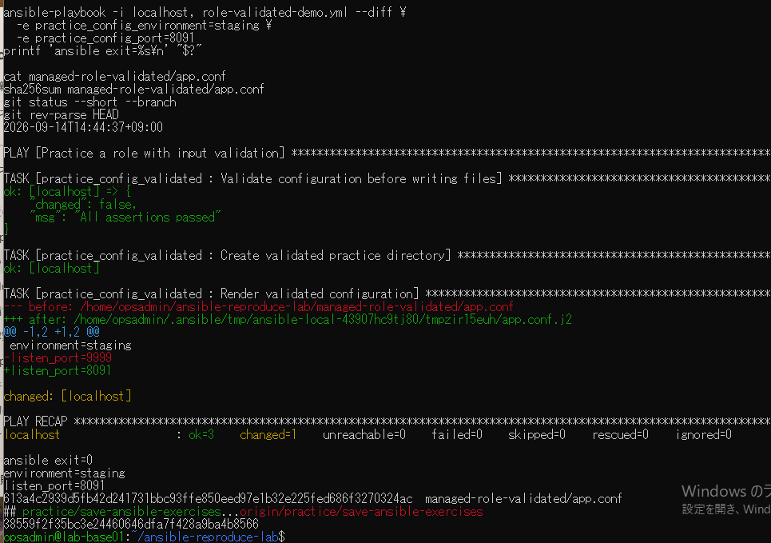
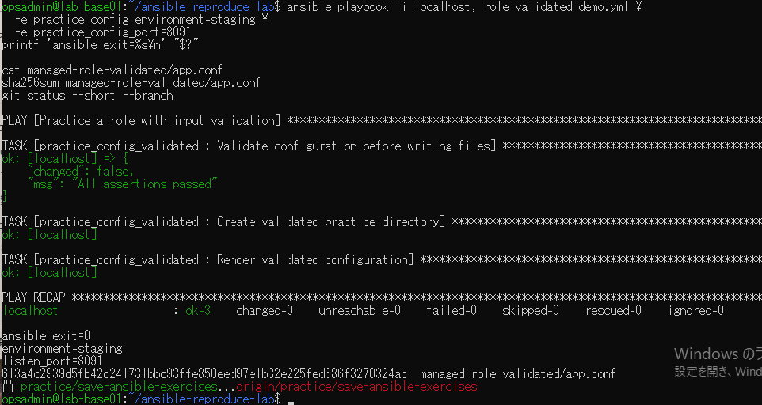

# lab-base01：設定ずれ修正の原画像

[結果票](../../2026-09-14-lab-base01-drift-practice.md)

本人提供画像4枚を無加工で保存。ユーザー名・ホスト名・パス（一時パスを含む）・日時・設定本文・Git状態・SHAを含む。
秘密鍵本文やパスワードは含まない。画像ハッシュはコピー一致確認で、主体や日時の第三者認証ではない。

[元画像名・サイズ・SHA-256](manifest.json) / [SHA256SUMS](SHA256SUMS.txt)

## E01 clone先の開始状態

## E02 設定ずれ検出と変更予測

## E03 通常実行による修正

## E04 修正後の再実行

