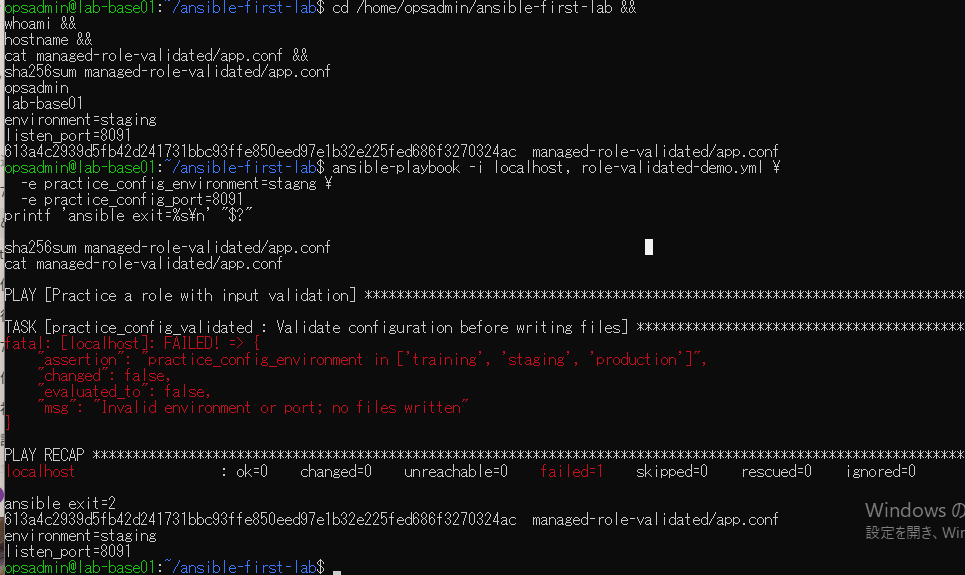
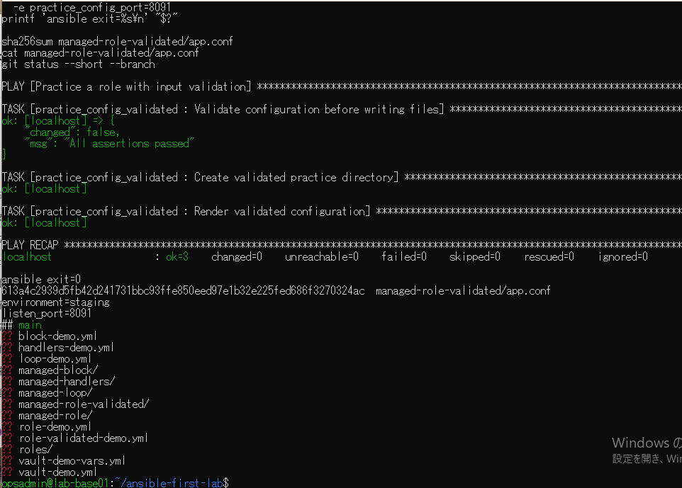

# lab-base01：環境名検証の原画像

[結果票](../../2026-09-14-lab-base01-env-validation-practice.md)

本人提供画像2枚を無加工で保存。ユーザー名・ホスト名・演習パス・設定本文・Git状態・SHA-256を含む。
秘密鍵本文やパスワードは含まない。画像ハッシュはコピー一致確認用で、主体や撮影日時の第三者認証ではない。

[元画像名・サイズ・SHA-256](manifest.json) / [SHA256SUMS](SHA256SUMS.txt)

## E01 環境名の拒否と前後ハッシュ一致

## E02 正常再実行と最終状態

