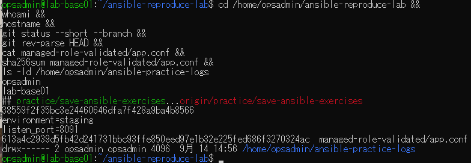
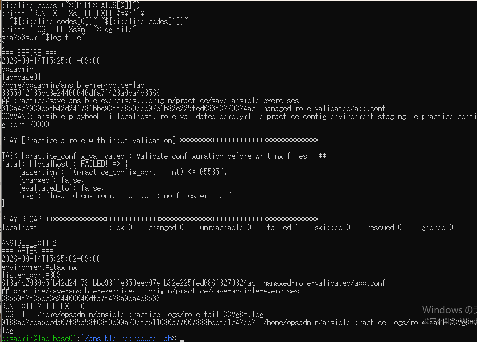
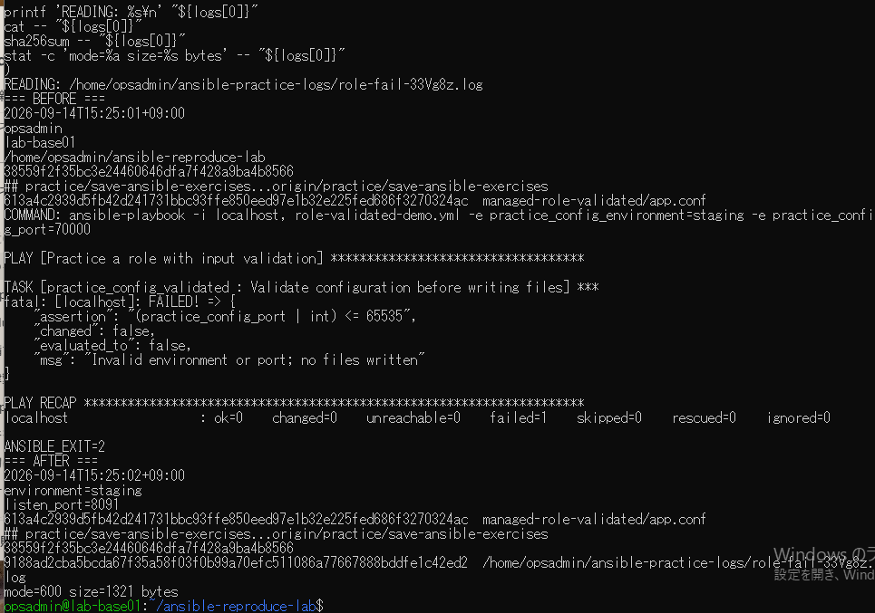

# lab-base01：失敗ログ演習の原画像

[結果票](../../practice/2026-09-14-lab-base01-failure-log-practice.md)

本人提供画像3枚を無加工で保存。ユーザー名・ホスト名・パス・日時・Git状態・設定本文・SHA・ログ内容を含む。
秘密鍵本文やパスワードは含まない。ログ実体はVM内にあり、この資料では画像として参照する。
画像ハッシュはコピー一致確認で、主体や日時の第三者認証ではない。

[元画像名・サイズ・SHA-256](manifest.json) / [SHA256SUMS](SHA256SUMS.txt)

## E01 開始状態とログ保存先

## E02 Ansible失敗とログ保存成功

## E03 失敗ログの読み戻し

