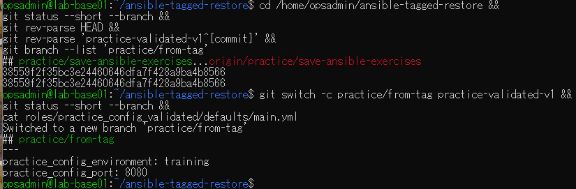
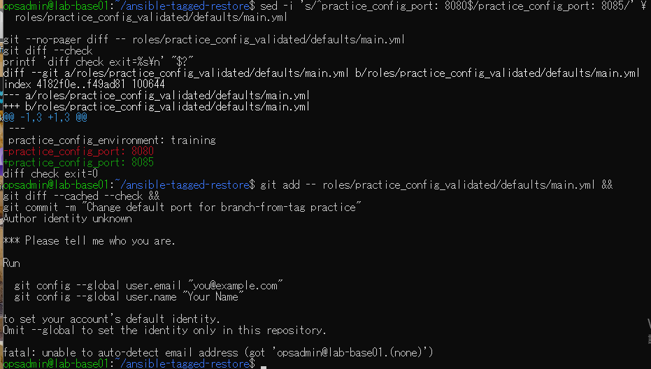
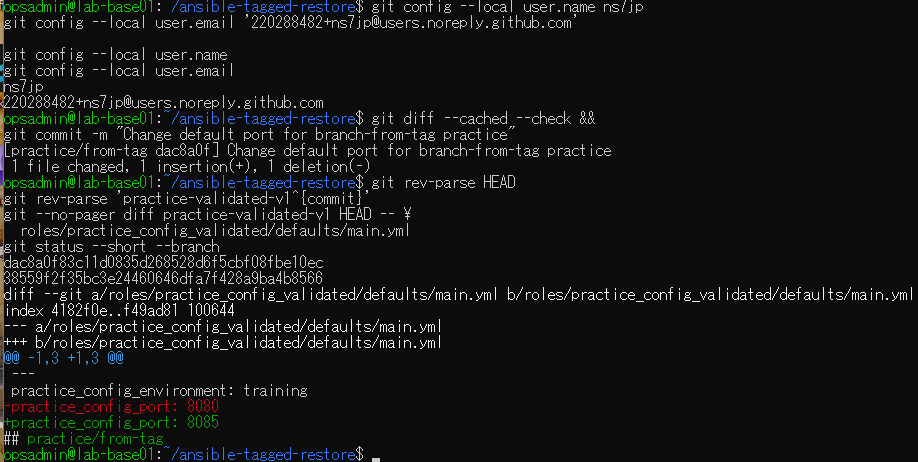

# タグ起点の変更コミットの原画像

[結果票](../../practice/2026-09-14-lab-base01-from-tag-practice.md)

本人提供画像3枚を無加工で保存。ユーザー名・ホスト名・演習パス・Git identityのnoreplyメール・SHA・差分を含む。
秘密鍵本文やパスワードは含まない。ハッシュは画像コピー一致確認で、主体や日時の第三者認証ではない。

[元画像名・サイズ・SHA-256](manifest.json) / [SHA256SUMS](SHA256SUMS.txt)

## E01 タグからのブランチ作成

## E02 差分とidentity未設定による停止

## E03 ローカル設定・コミット・タグ維持

