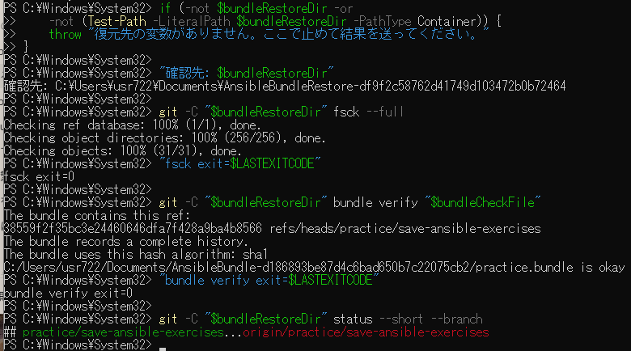

# Windows Git整合性検査の原画像

[結果票](../../2026-09-14-lab-base01-git-integrity-practice.md)

本人提供画像1枚を無加工で保存。Windowsユーザーパス・bundle保存先・復元先・ブランチ名・SHAを含む。
秘密鍵本文やパスワードは含まない。bundle・復元ソース実体は添付しない。画像ハッシュはコピー一致確認用。

[元画像名・サイズ・SHA-256](manifest.json) / [SHA256SUMS](SHA256SUMS.txt)

## E01 fsck・bundle verify・status

