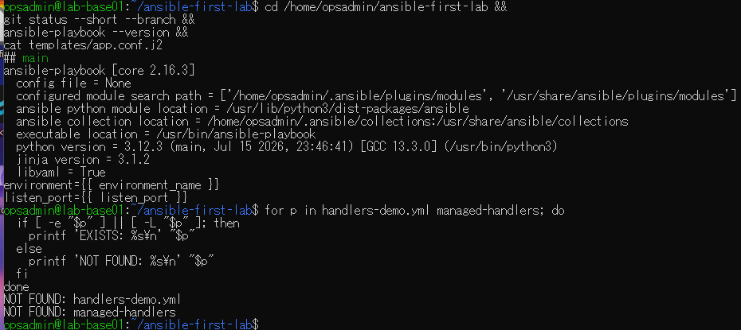
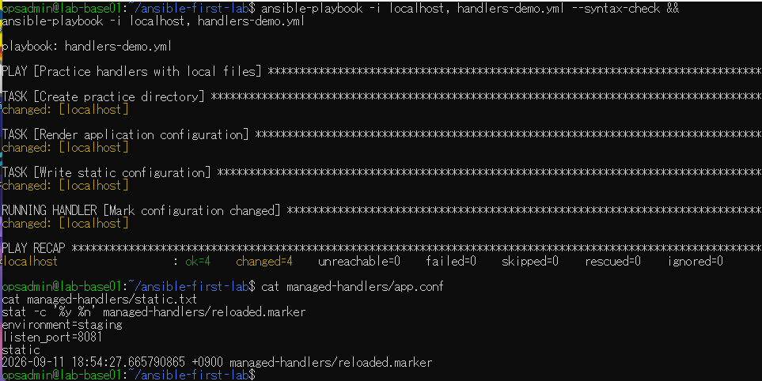
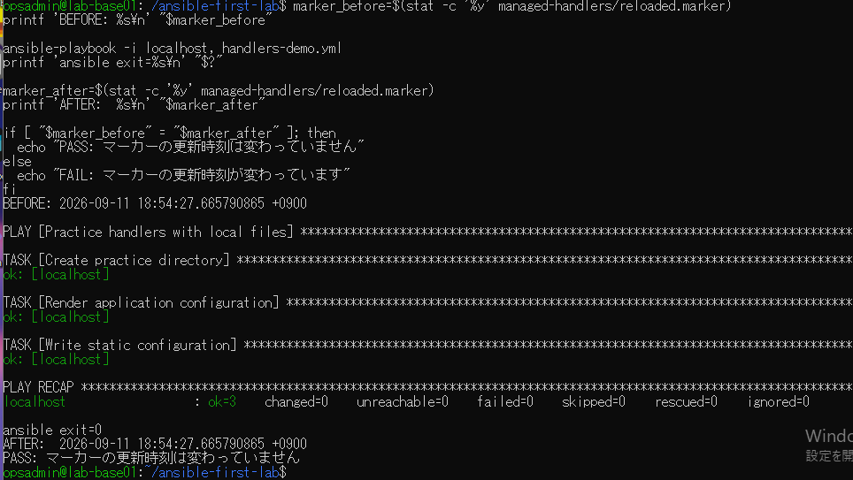
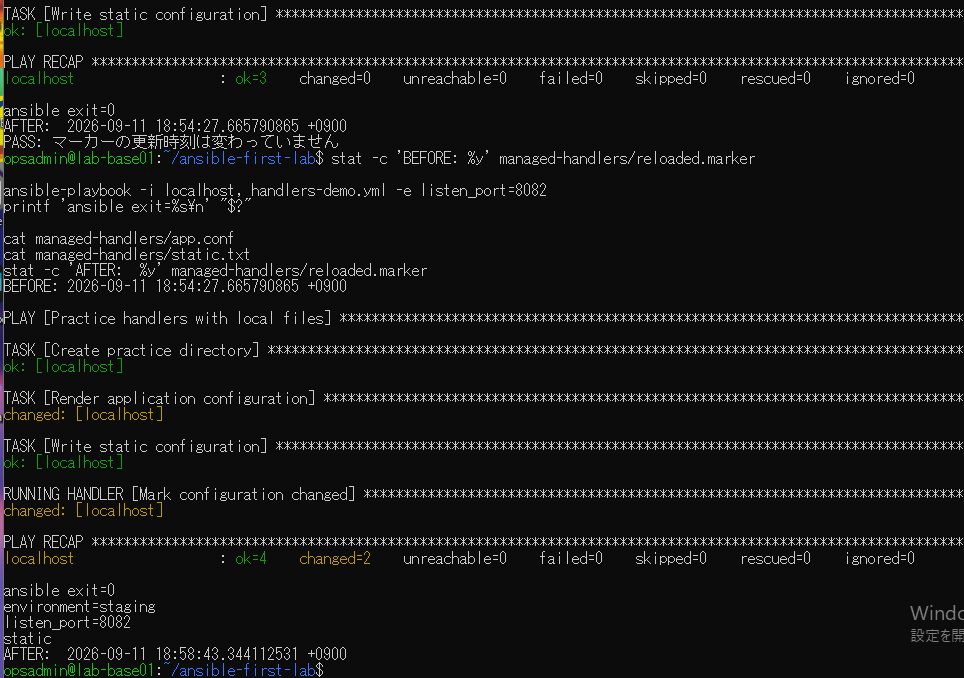
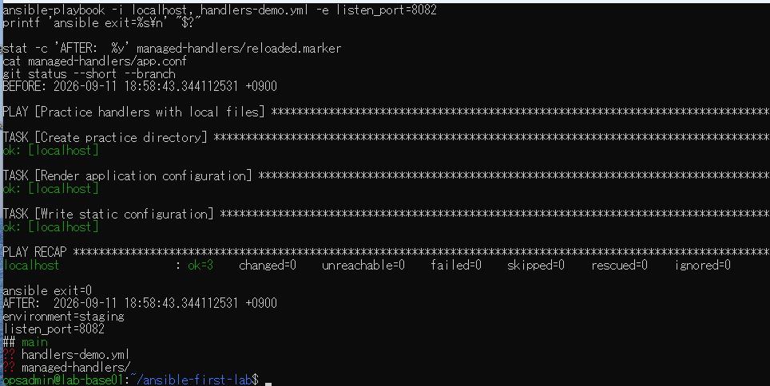

# lab-base01：ハンドラー演習の原画像

[結果票](../../2026-09-14-lab-base01-handlers-practice.md)

本人提供の原画像5枚を無加工で保存。ユーザー名・ホスト名・ホーム内パス・ソフトウェア版・
ファイル更新日時を含む。秘密鍵本文・パスワードは含まない。
ハッシュはコピー一致確認用で、撮影日時や実施主体の第三者認証ではない。

[元画像名・サイズ・SHA-256](manifest.json) / [SHA256SUMS](SHA256SUMS.txt)

## E01 前提・テンプレート・名前未使用

## E02 初回changed4とハンドラー1回

## E03 8081再実行と時刻一致

## E04 8082への変更とマーカー更新

## E05 8082再実行・時刻一致・Git状態

