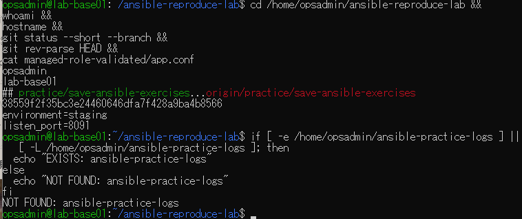
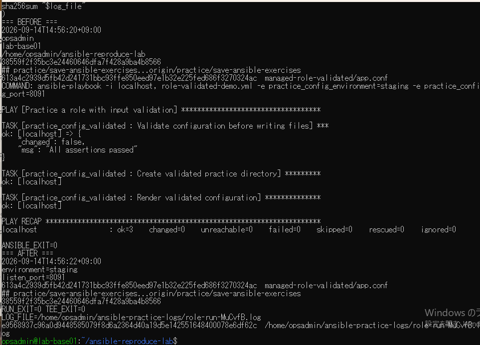
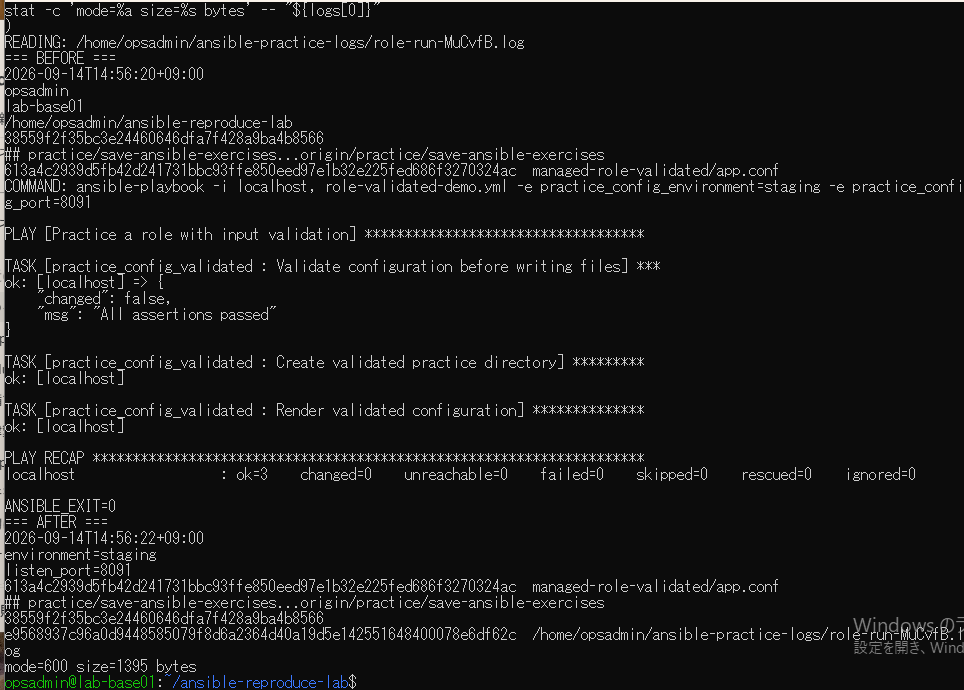

# lab-base01：ログ保存演習の原画像

[結果票](../../2026-09-14-lab-base01-log-capture-practice.md)

本人提供画像3枚を無加工で保存。ユーザー名・ホスト名・パス・日時・設定本文・Git状態・SHA・ログ内容を含む。
秘密鍵本文やパスワードは含まない。ログ実体はVM内にあり、この資料では画像として参照する。
画像ハッシュはコピー一致確認用で、実行主体や日時の第三者認証ではない。

[元画像名・サイズ・SHA-256](manifest.json) / [SHA256SUMS](SHA256SUMS.txt)

## E01 VM・作業状態・保存先未使用

## E02 実行出力と終了コード・ログ保存

## E03 読み戻し・ハッシュ・権限とサイズ

