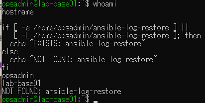
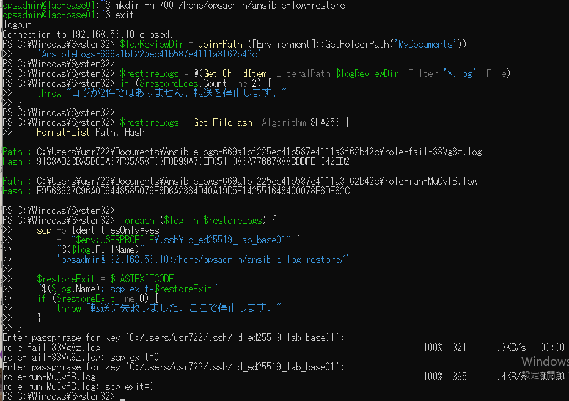
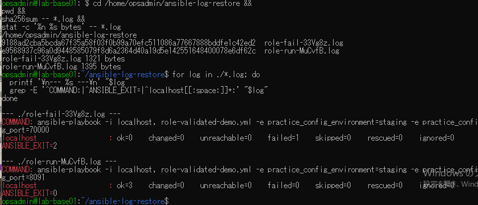

# lab-base01：ログ復元の原画像

[結果票](../../2026-09-14-lab-base01-log-restore-practice.md)

本人提供画像3枚を無加工で保存。ユーザー名・ホスト名・プライベートIP・SSH鍵パス・Windows保存先・ログ名・SHA・抽出内容を含む。
秘密鍵本文や入力パスフレーズは表示されていない。ログ実体は添付しない。
画像ハッシュはコピー一致確認用で、主体や日時の第三者認証ではない。

[元画像名・サイズ・SHA-256](manifest.json) / [SHA256SUMS](SHA256SUMS.txt)

## E01 VMと復元先未使用

## E02 復元先作成・Windowsハッシュ・転送

## E03 復元後ハッシュと内容確認

