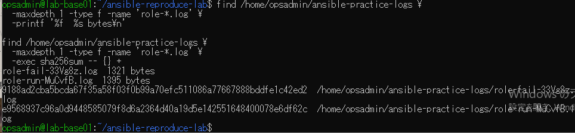
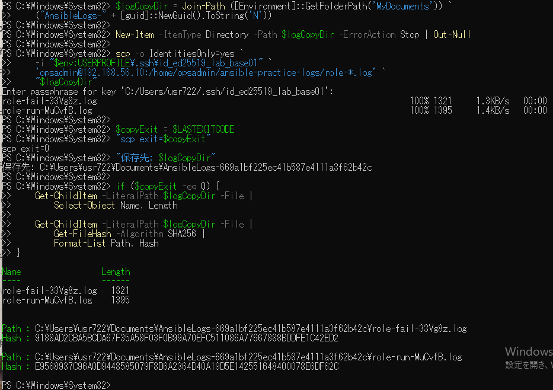

# lab-base01：ログ転送の原画像

[結果票](../../practice/2026-09-14-lab-base01-log-transfer-practice.md)

本人提供画像2枚を無加工で保存。ユーザー名・ホスト名・VMのプライベートIP・パス・SSH鍵ファイル名・ログ名・SHAを含む。
秘密鍵本文やパスフレーズの入力文字は表示されていない。ログ実体はこの公開資料へ添付しない。
画像ハッシュはコピー一致確認で、主体や日時の第三者認証ではない。

[元画像名・サイズ・SHA-256](manifest.json) / [SHA256SUMS](SHA256SUMS.txt)

## E01 VM内の2ログ・サイズ・ハッシュ

## E02 Windowsへの転送・サイズ・ハッシュ

