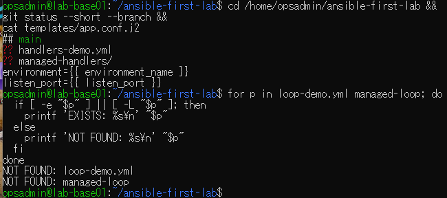
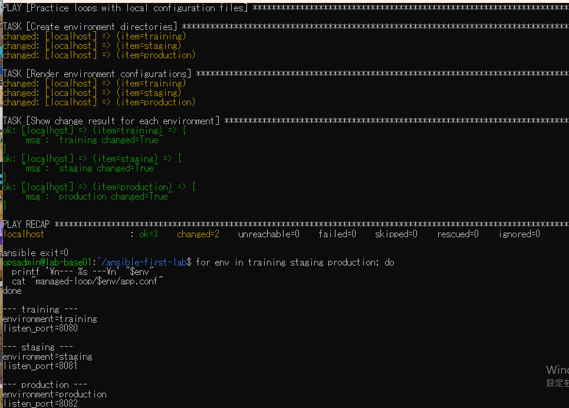
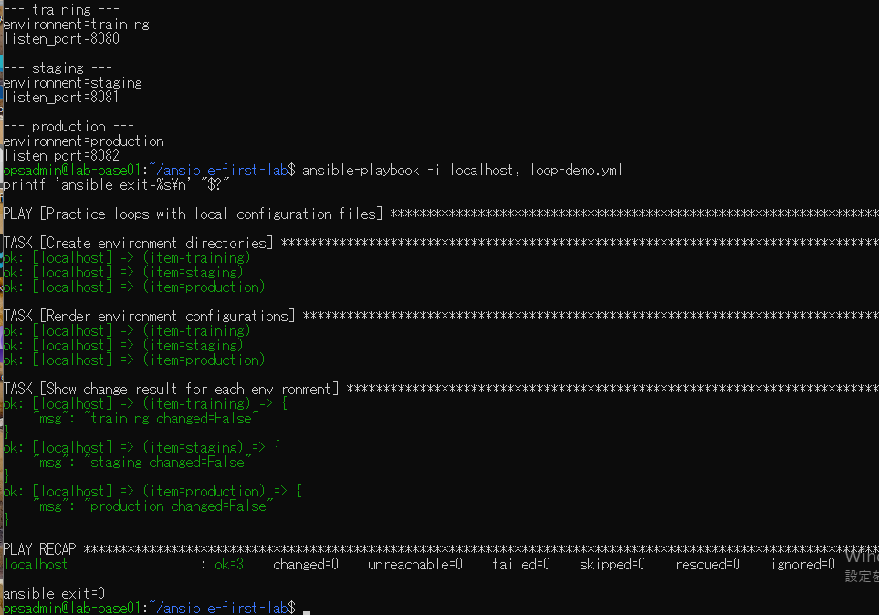
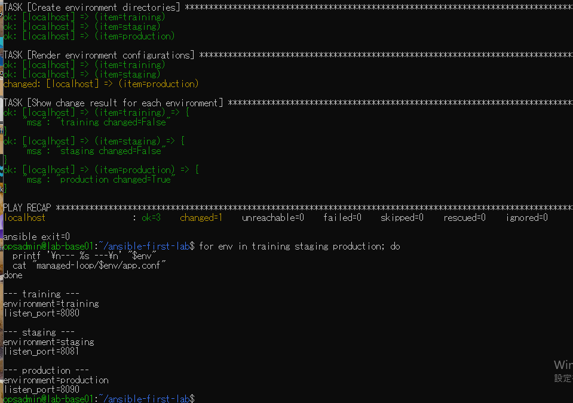
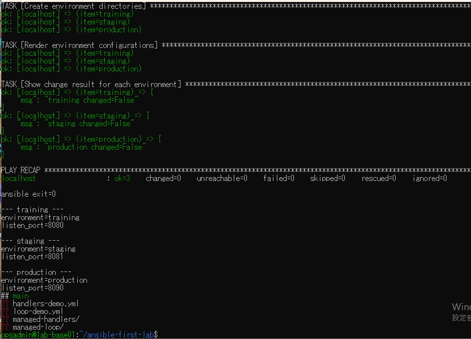

# lab-base01：loop演習の原画像

[結果票](../../practice/2026-09-14-lab-base01-loop-practice.md)

本人提供画像5枚を無加工で保存。ユーザー名・ホスト名・演習パス・Git状態を含む。
秘密鍵本文やパスワードは含まない。ハッシュはコピー一致の確認用で、主体や日時の第三者認証ではない。

[元画像名・サイズ・SHA-256](manifest.json) / [SHA256SUMS](SHA256SUMS.txt)

## E01 開始状態・テンプレート・名前未使用

## E02 初回生成と3環境の本文

## E03 同内容の再実行

## E04 productionだけ更新

## E05 変更後の再実行と最終状態

