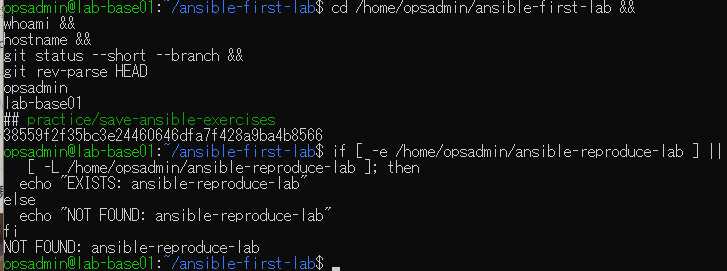
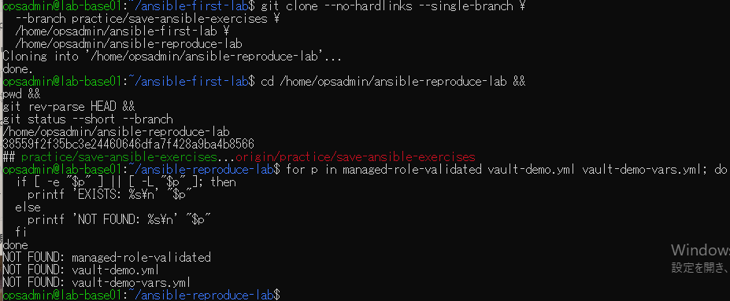
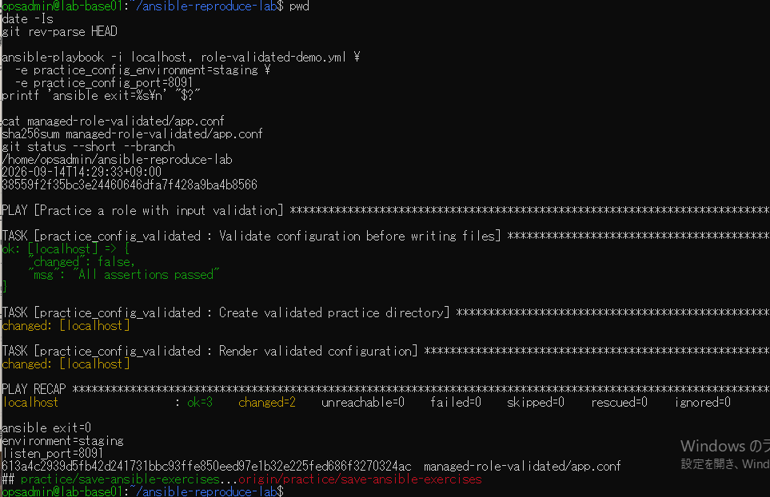
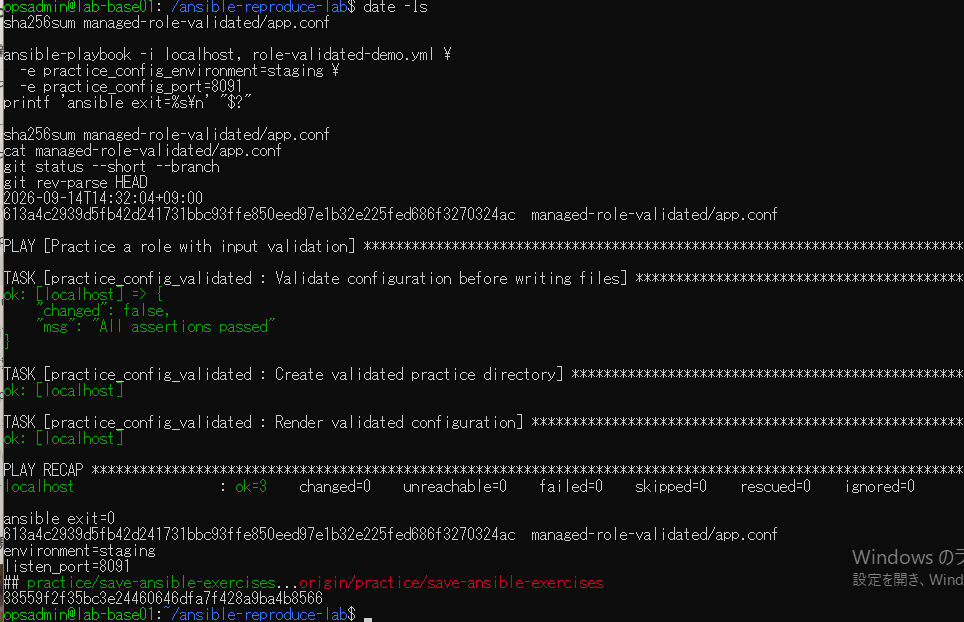

# lab-base01：clone再現演習の原画像

[結果票](../../2026-09-14-lab-base01-reproduce-practice.md)

本人提供画像4枚を無加工で保存。ユーザー名・ホスト名・パス・日時・Git状態・設定本文・SHAを含む。
Vaultファイル名は表示されるが、秘密鍵本文・Vaultパスワード・暗号文本文は含まない。
画像ハッシュはコピー一致確認用で、主体や撮影日時の第三者認証ではない。

[元画像名・サイズ・SHA-256](manifest.json) / [SHA256SUMS](SHA256SUMS.txt)

## E01 元リポジトリと再現先未使用

## E02 ローカルcloneと出力未生成

## E03 clone先での新規生成

## E04 同条件再実行と最終状態

