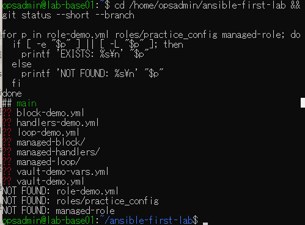
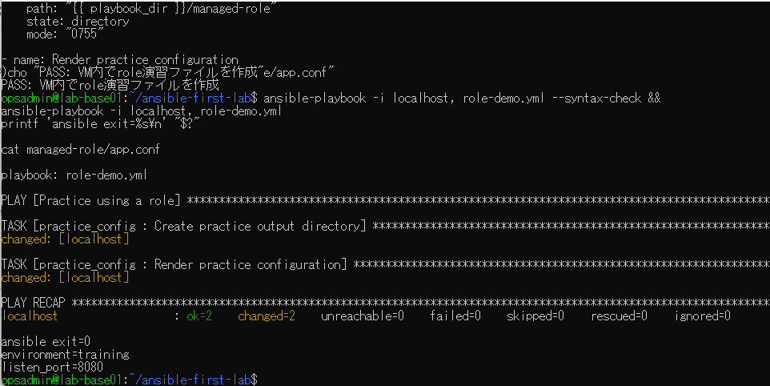
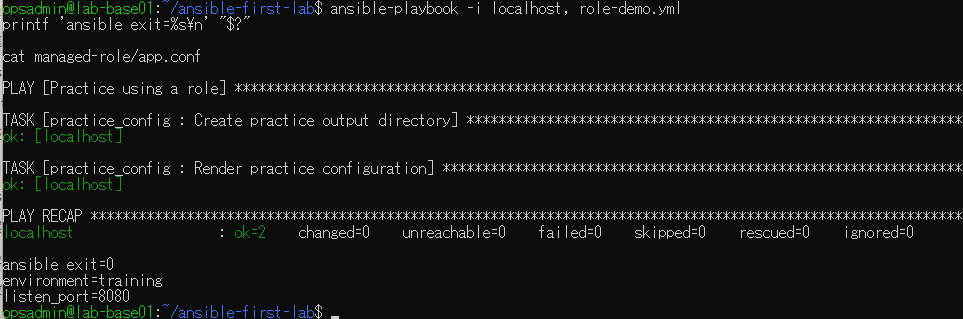
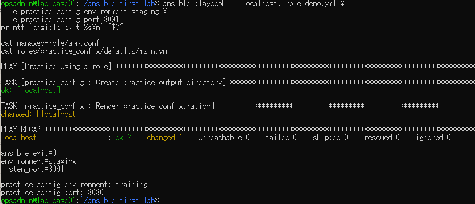
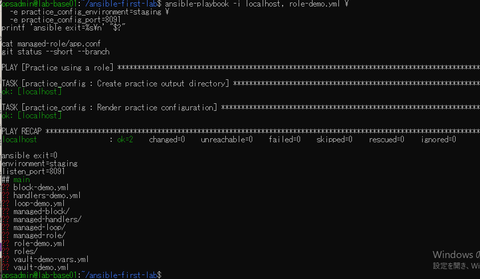

# lab-base01：role演習の原画像

[結果票](../../practice/2026-09-14-lab-base01-role-practice.md)

本人提供のVM側原画像5枚を無加工で保存。ユーザー名・ホスト名・演習パス・Git状態を含む。
秘密鍵本文やパスワードは含まない。別環境での実行画像は公開対象外。
ハッシュはコピー一致の確認用で、実施主体や日時の第三者認証ではない。

[元画像名・サイズ・SHA-256](manifest.json) / [SHA256SUMS](SHA256SUMS.txt)

## E01 VM側の再確認と名前未使用

## E02 VMでの初回実行

## E03 既定値での再実行

## E04 実行時変数による上書き

## E05 上書き条件の再実行と最終状態

