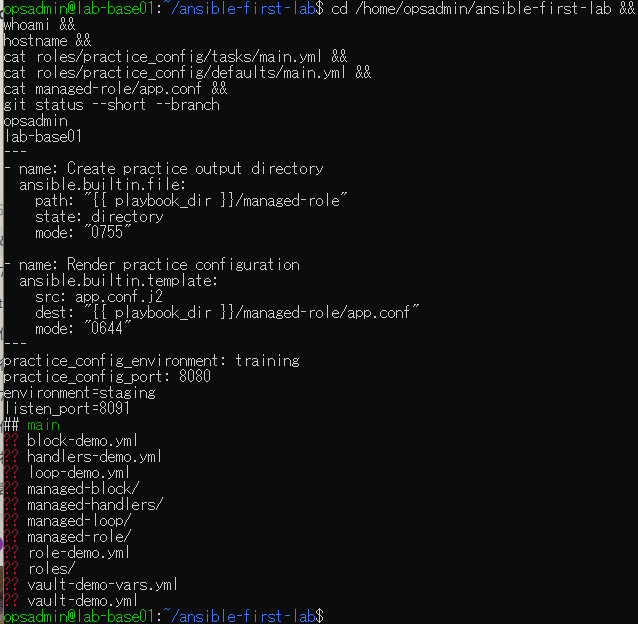
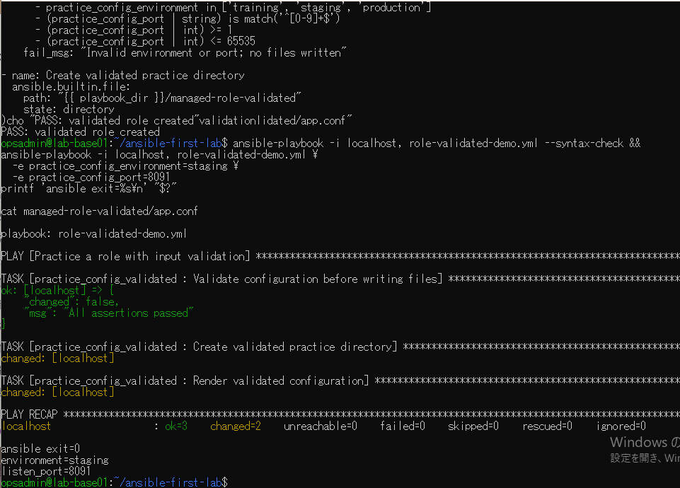
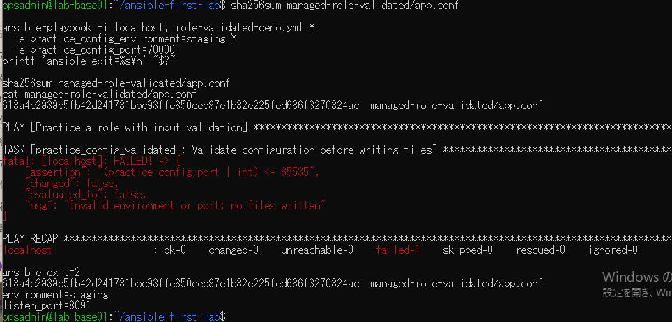
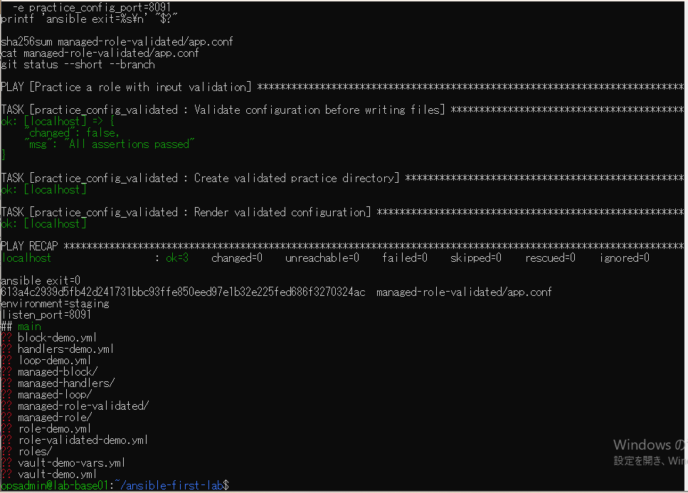

# lab-base01：role入力検証の原画像

[結果票](../../practice/2026-09-14-lab-base01-role-validation-practice.md)

本人提供画像4枚を無加工で保存。ユーザー名・ホスト名・演習パス・Git状態・生成ファイルのSHA-256を含む。
秘密鍵本文・パスワードは含まない。画像ハッシュはコピー一致確認で、主体や撮影日時の第三者認証ではない。

[元画像名・サイズ・SHA-256](manifest.json) / [SHA256SUMS](SHA256SUMS.txt)

## E01 VMと既存roleの確認

## E02 8091の受入と初回生成

## E03 70000の拒否とハッシュ一致

## E04 正常再実行と最終状態

