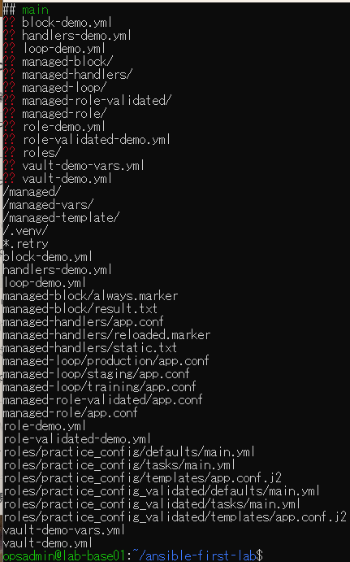
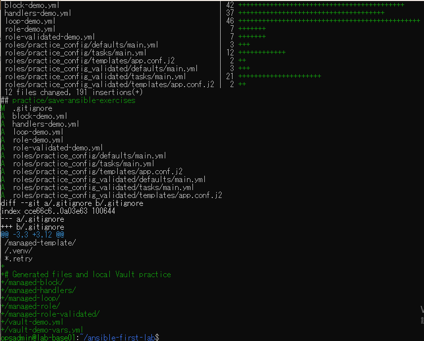
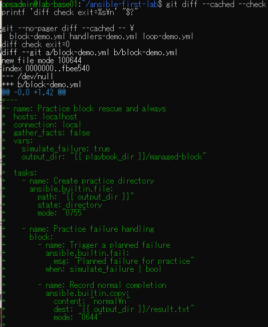
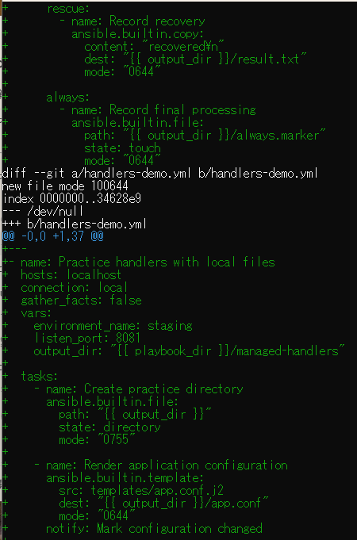
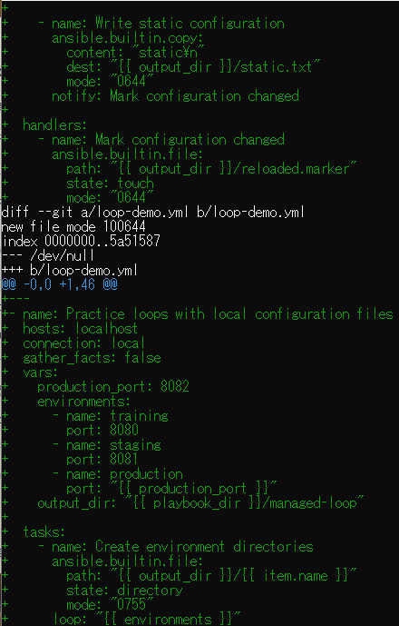
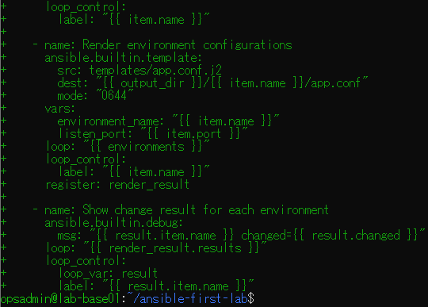
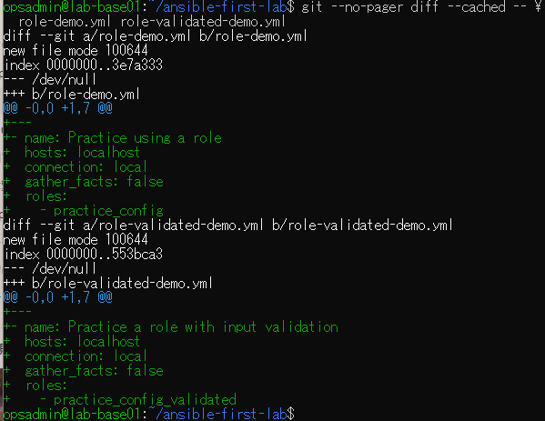
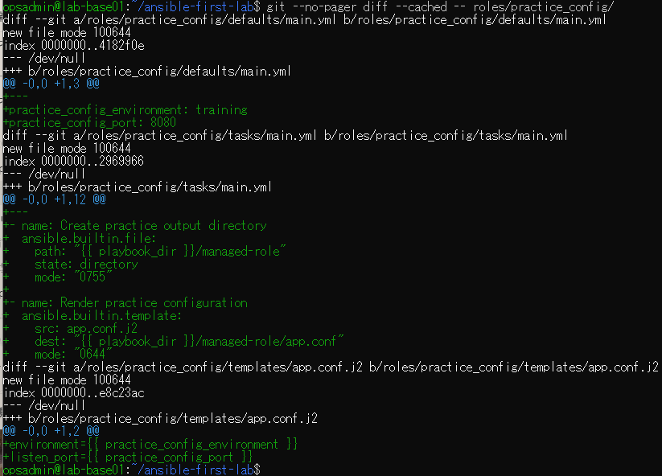
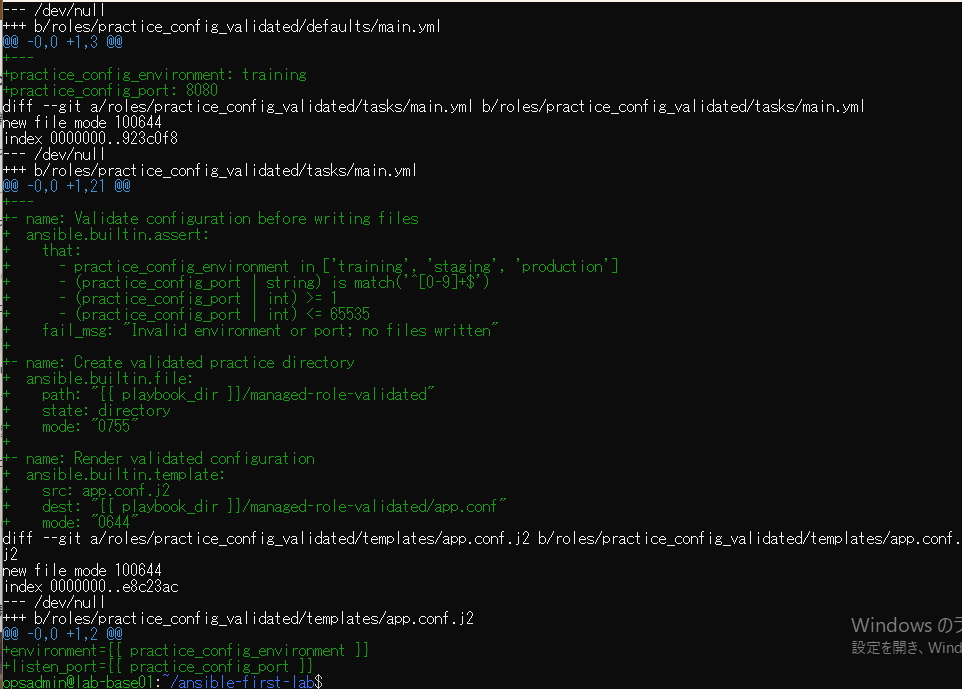
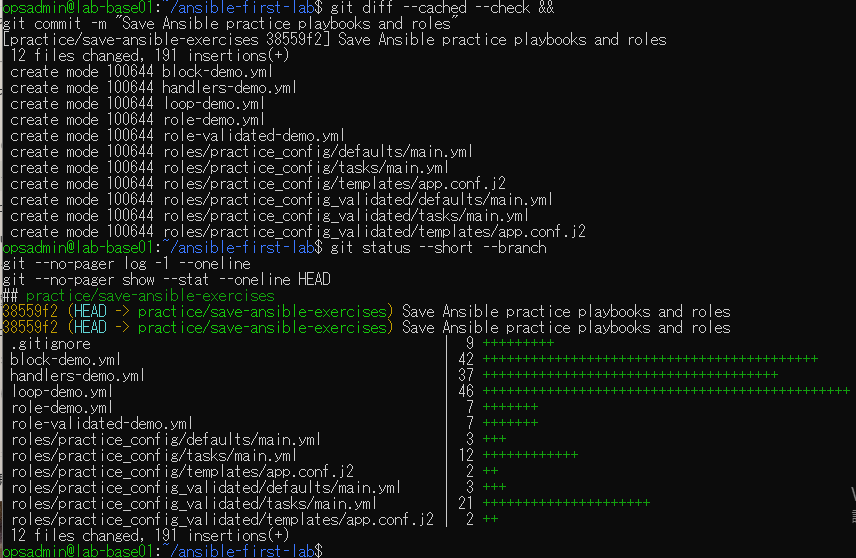

# lab-base01：演習ソース保存の原画像

[結果票](../../2026-09-14-lab-base01-save-ansible-practice.md)

本人提供画像10枚を無加工で保存。ユーザー名・ホスト名・演習パス・ソース差分・Git状態・短縮SHAを含む。
秘密鍵本文・Vaultパスワード・Vault暗号文本文は含まない。Vaultファイル名は一覧に表示される。
画像ハッシュはコピー一致確認用で、主体や日時の第三者認証ではない。

[元画像名・サイズ・SHA-256](manifest.json) / [SHA256SUMS](SHA256SUMS.txt)

## E01 未追跡一覧と既存除外ルール

## E02 12ファイルの選別と除外追加

## E03 空白検査とblock前半

## E04 block後半とhandlers前半

## E05 handlers後半とloop前半

## E06 loop後半

## E07 role呼び出し2件

## E08 通常roleの差分

## E09 検証付きroleの差分

## E10 コミットと変更なしの状態

