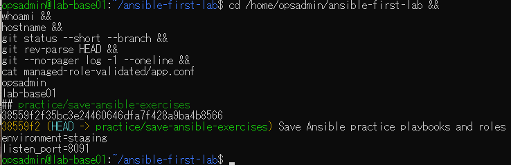
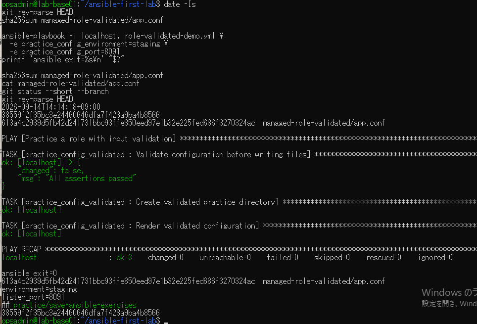

# lab-base01：保存版再実行の原画像

[結果票](../../2026-09-14-lab-base01-saved-rerun-practice.md)

本人提供画像2枚を無加工で保存。ユーザー名・ホスト名・パス・日時・設定本文・Git状態・SHAを含む。
秘密鍵本文やパスワードは含まない。画像ハッシュはコピー一致確認で、主体や日時の第三者認証ではない。

[元画像名・サイズ・SHA-256](manifest.json) / [SHA256SUMS](SHA256SUMS.txt)

## E01 VM・保存コミット・開始状態

## E02 日時・再実行・前後状態

