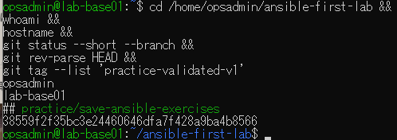
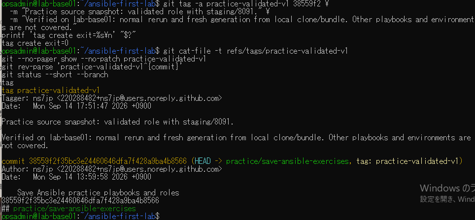

# 注釈付きタグ演習の原画像

[結果票](../../practice/2026-09-14-lab-base01-tag-practice.md)

本人提供画像2枚を無加工で保存。ユーザー名・ホスト名・演習パス・タグ名・SHA・Git author/taggerのnoreplyメール・日時を含む。
秘密鍵本文・パスワードは含まない。ハッシュは画像コピーの一致確認用で、日時や主体の第三者認証ではない。

[元画像名・サイズ・SHA-256](manifest.json) / [SHA256SUMS](SHA256SUMS.txt)

## E01 開始状態とタグ未作成

## E02 注釈付きタグ作成と参照先

