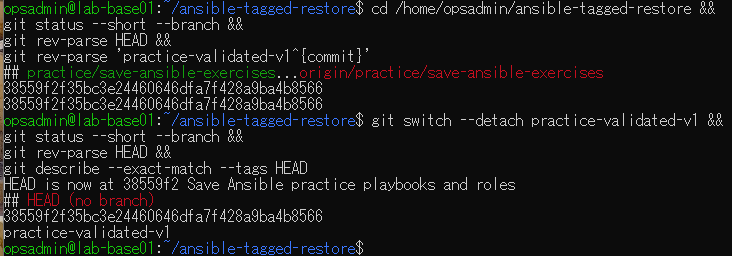
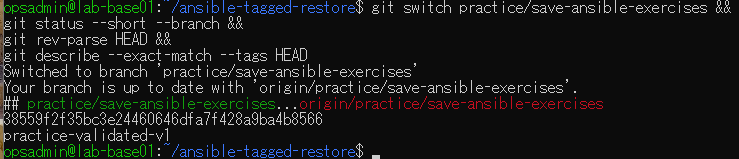

# タグ切替演習の原画像

[結果票](../../2026-09-14-lab-base01-tag-switch-practice.md)

本人提供画像2枚を無加工で保存。ユーザー名・ホスト名・パス・ブランチ名・タグ名・SHAを含む。
秘密鍵本文やパスワードは含まない。画像ハッシュはコピー一致確認用で、主体や日時の第三者認証ではない。

[元画像名・サイズ・SHA-256](manifest.json) / [SHA256SUMS](SHA256SUMS.txt)

## E01 タグ指定でdetached HEADへ切替

## E02 元のブランチへ復帰

