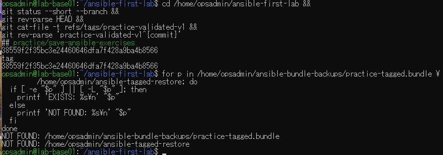
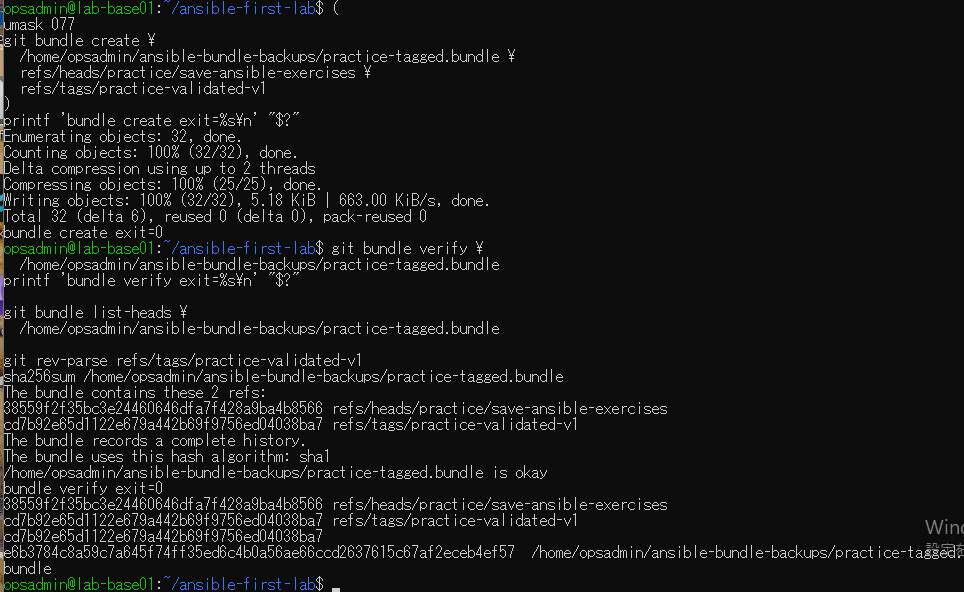
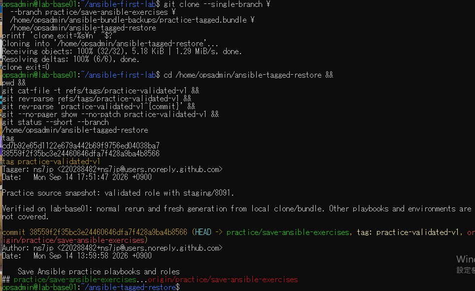

# タグ付きbundle復元の原画像

[結果票](../../practice/2026-09-14-lab-base01-tagged-bundle-practice.md)

本人提供画像3枚を無加工で保存。ユーザー名・ホスト名・パス・タグ名・SHA・author/taggerのnoreplyメール・日時・注釈を含む。
秘密鍵本文・パスワードは含まない。bundle実体は添付しない。画像ハッシュはコピー一致確認用。

[元画像名・サイズ・SHA-256](manifest.json) / [SHA256SUMS](SHA256SUMS.txt)

## E01 タグと開始状態

## E02 ブランチとタグのbundle作成・検査

## E03 復元後のタグ・注釈・参照先

