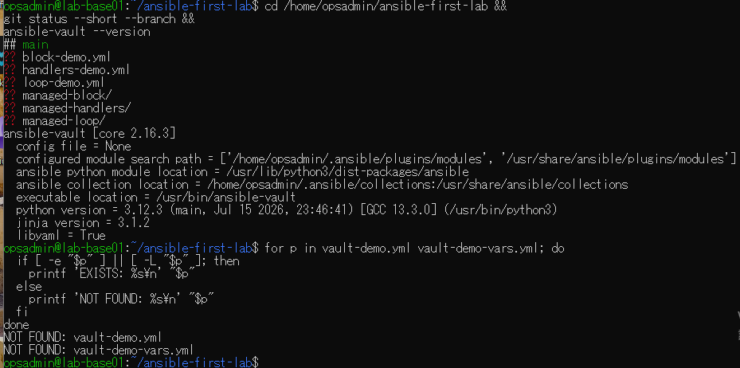
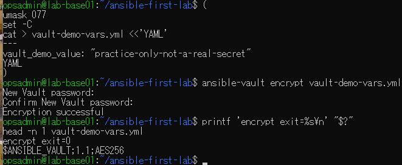
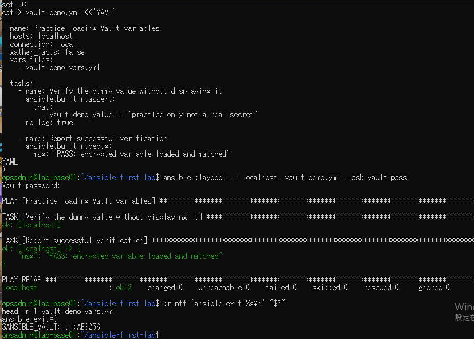
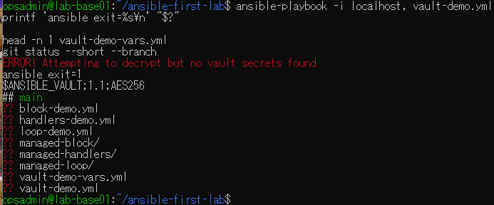

# lab-base01：Vault演習の原画像

[結果票](../../practice/2026-09-14-lab-base01-vault-practice.md)

本人提供画像4枚を無加工で保存。ユーザー名・ホスト名・パス・版情報・Git状態と公開用ダミー値を含む。
Vaultパスワードの入力文字、秘密鍵本文、実際の認証情報は表示されていない。
暗号文ファイル本体は添付しない。ハッシュは画像コピーの一致確認であり、主体や日時の第三者認証ではない。

[元画像名・サイズ・SHA-256](manifest.json) / [SHA256SUMS](SHA256SUMS.txt)

## E01 前提と名前未使用

## E02 ダミー値の作成と暗号化

## E03 パスワード付き読み込み

## E04 パスワードなしの拒否と最終状態

