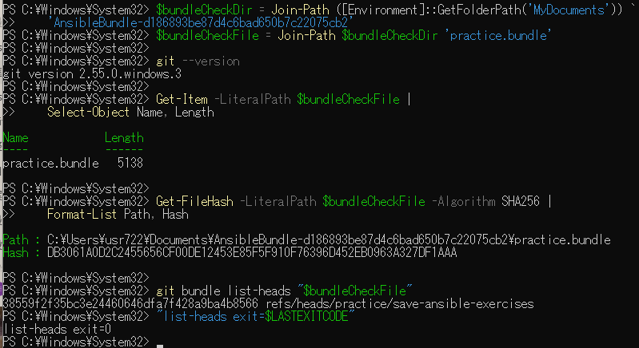
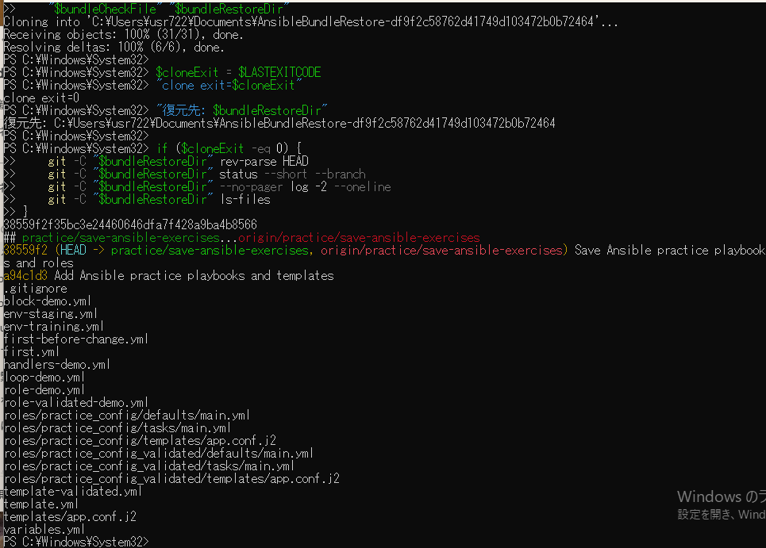

# Windows上のbundle復元の原画像

[結果票](../../practice/2026-09-14-lab-base01-windows-bundle-practice.md)

本人提供画像2枚を無加工で保存。Windowsユーザーパス・保存先と復元先・Git版・SHA・ブランチ名・ファイル一覧を含む。
秘密鍵本文やパスワードは含まない。bundle実体と復元ソース実体は添付しない。
画像ハッシュはコピー一致確認用で、主体や日時の第三者認証ではない。

[元画像名・サイズ・SHA-256](manifest.json) / [SHA256SUMS](SHA256SUMS.txt)

## E01 Windows Git・bundleサイズ・ハッシュ・ref

## E02 clone・HEAD・履歴・追跡ファイル一覧

