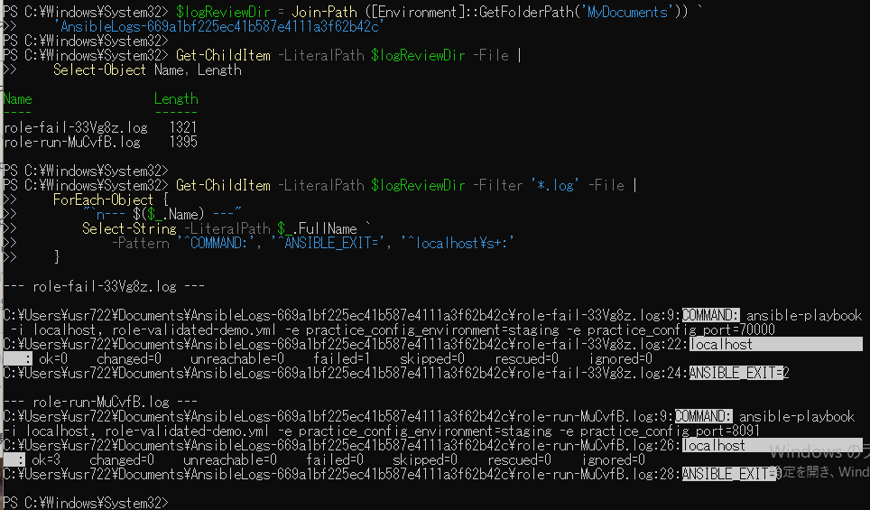

# Windows側ログ確認の原画像

[結果票](../../2026-09-14-lab-base01-windows-log-review-practice.md)

本人提供画像1枚を無加工で保存。Windowsのユーザーパス・保存先・ログ名・コマンドと抽出結果を含む。
秘密鍵本文やパスワードは含まない。ログ実体は添付しない。ハッシュは画像コピー一致の確認用。

[元画像名・サイズ・SHA-256](manifest.json) / [SHA256SUMS](SHA256SUMS.txt)

## E01 ファイル一覧とログ抽出結果

