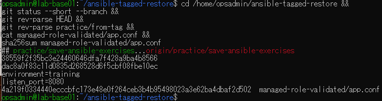
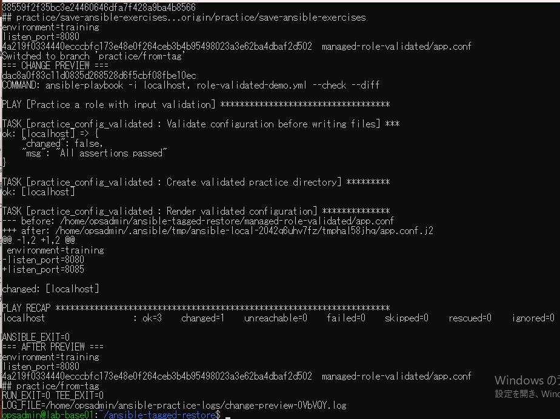
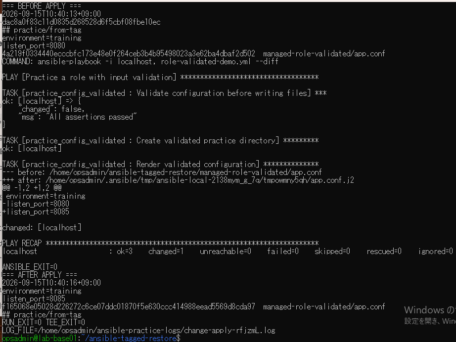
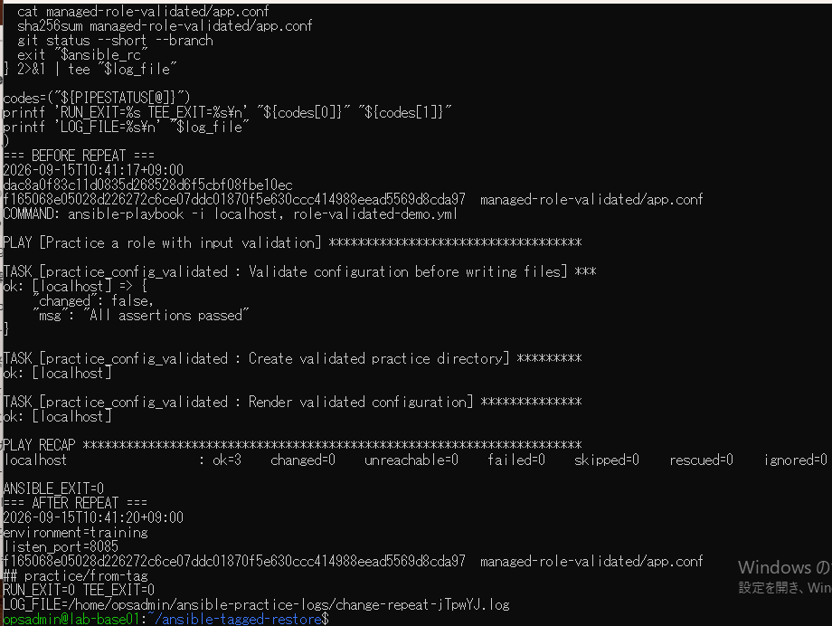
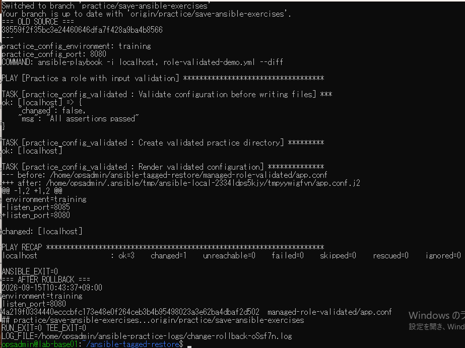
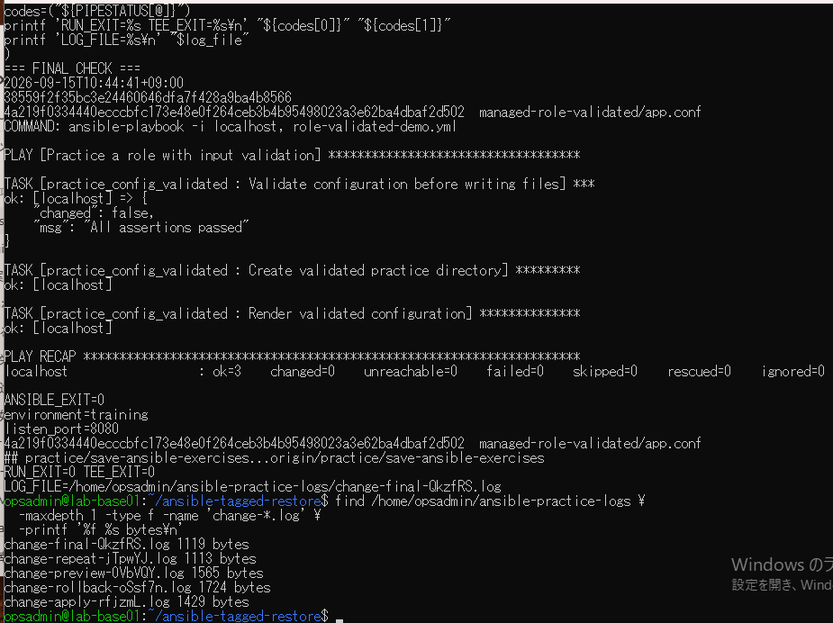

# 変更・切り戻し一連演習の原画像

[結果票](../../2026-09-15-lab-base01-change-cycle-practice.md)

本人提供画像6枚を無加工で保存。ユーザー名・ホスト名・パス（一時パスを含む）・日時・Git状態・SHA・設定本文・ログ名を含む。
秘密鍵本文・パスワードは含まない。VM内ログ実体は添付しない。画像ハッシュはコピー一致確認用。

[元画像名・サイズ・SHA-256](manifest.json) / [SHA256SUMS](SHA256SUMS.txt)

## E01 開始状態

## E02 変更予測

## E03 8085適用

## E04 適用後再実行

## E05 8080切り戻し

## E06 最終確認とログ一覧

