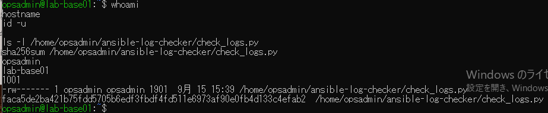
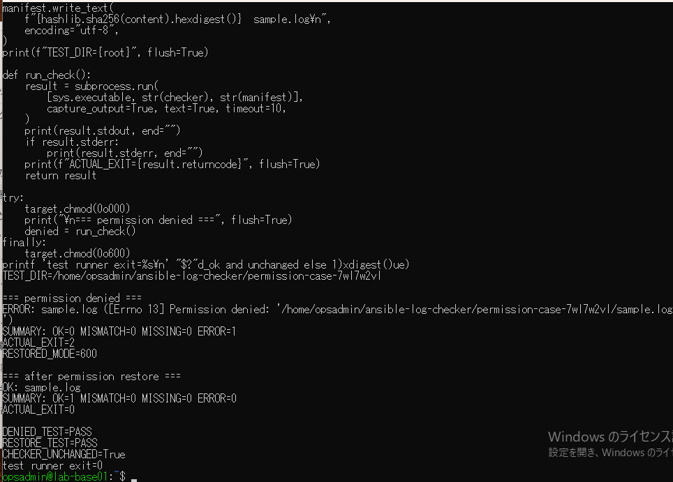

# ログ検証の権限不足試験の原画像

[結果票](../../practice/2026-09-15-lab-base01-checker-permission-practice.md)

本人提供画像2枚を無加工で保存。ユーザー名・ホスト名・UID・パス・スクリプト属性・SHA・コード断片・試験結果を含む。
秘密鍵本文やパスワードは含まない。スクリプト・ログ実体は添付しない。画像ハッシュはコピー一致確認用。

[元画像名・サイズ・SHA-256](manifest.json) / [SHA256SUMS](SHA256SUMS.txt)

## E01 非rootユーザーとスクリプト

## E02 権限不足と権限復帰の結果

