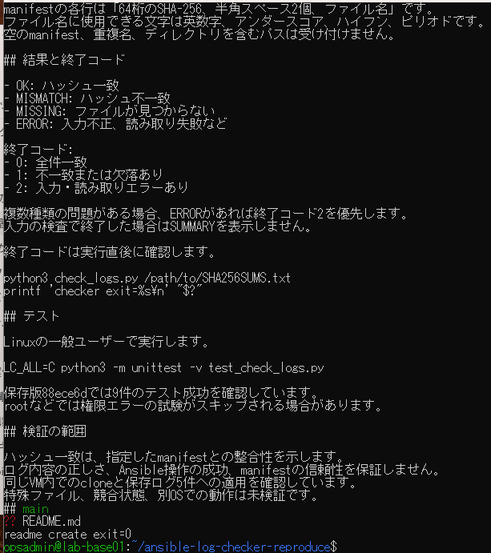
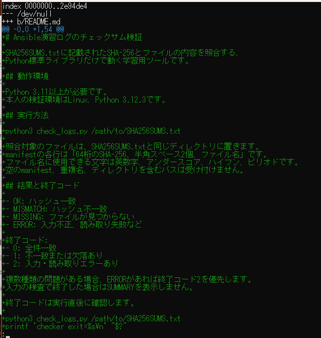
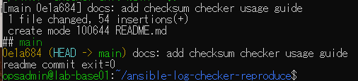
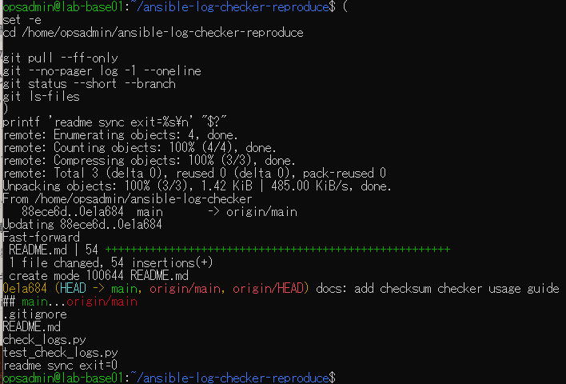

# README作成・保存・同期の原画像

[結果票](../../practice/2026-09-15-lab-base01-checker-readme-practice.md)

本人提供画像4枚を無加工で保存。VMユーザー名・ホスト名・パス・短縮SHA・文書内容・操作結果を含む。
画像のSHA-256はコピー一致確認用。VM上のREADME実体は取得していない。

[元画像名・サイズ・SHA-256](manifest.json) / [SHA256SUMS](SHA256SUMS.txt)

## E01 README作成

## E02 README差分表示

## E03 READMEコミット

## E04 clone先への同期

