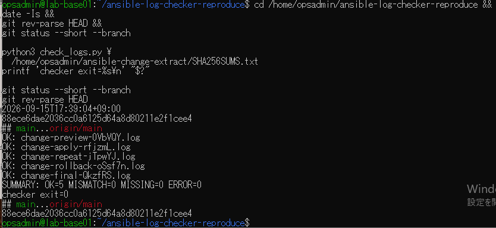

# 保存ログへの適用結果の原画像

[結果票](../../2026-09-15-lab-base01-checker-real-logs-practice.md)

本人提供画像1枚を無加工で保存。VMユーザー名・ホスト名・パス・時刻・コミットSHA・検証結果を含む。
画像ハッシュはコピー一致確認用で、VMのログハッシュとは別である。ログ実体は添付していない。

[元画像名・サイズ・SHA-256](manifest.json) / [SHA256SUMS](SHA256SUMS.txt)

## E01 clone先から保存ログ5件を検証

