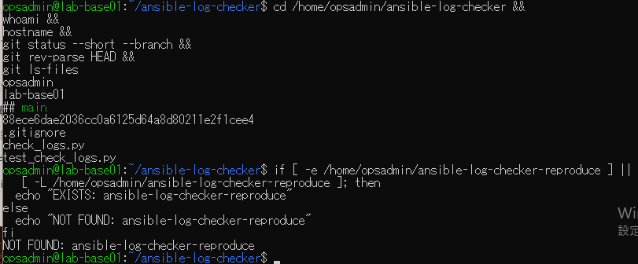
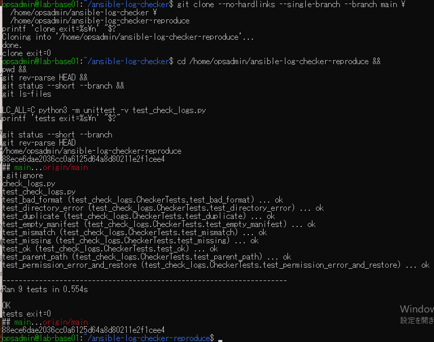

# ログ検証ツール再現試験の原画像

[結果票](../../2026-09-15-lab-base01-checker-reproduce-practice.md)

本人提供画像2枚を無加工で保存。ユーザー名・ホスト名・パス・コミットSHA・ファイル一覧・試験結果を含む。
秘密鍵本文やパスワードは含まない。ソース・試験データ実体は添付しない。画像ハッシュはコピー一致確認用。

[元画像名・サイズ・SHA-256](manifest.json) / [SHA256SUMS](SHA256SUMS.txt)

## E01 保存版と再現先未使用

## E02 clone先の9テスト再現

