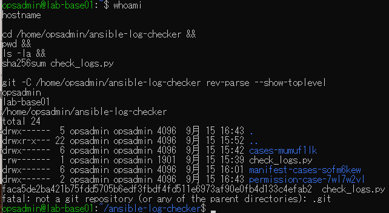
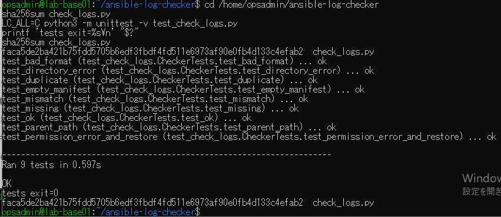
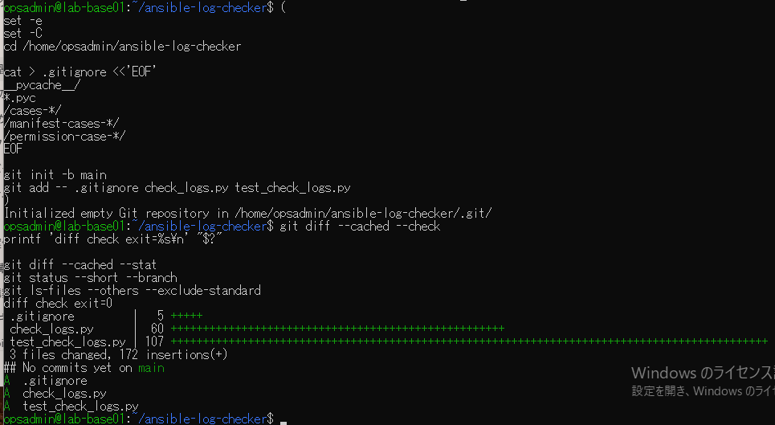
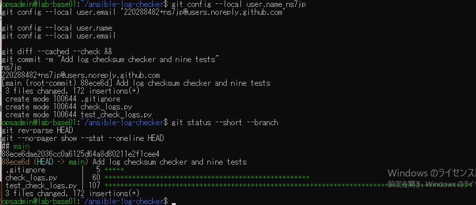
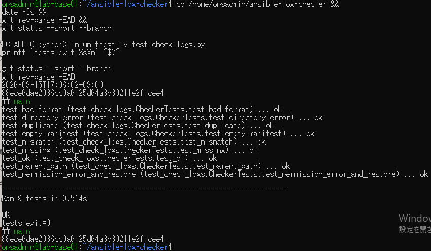

# ログ検証ソース保存・再検証の原画像

[結果票](../../practice/2026-09-15-lab-base01-checker-save-practice.md)

本人提供画像5枚を無加工で保存。ユーザー名・ホスト名・パス・ファイル属性・SHA・Git identityのnoreplyメール・日時・試験結果を含む。
秘密鍵本文やパスワードは含まない。VM内のソース実体や試験データ実体は添付しない。画像ハッシュはコピー一致確認用。

[元画像名・サイズ・SHA-256](manifest.json) / [SHA256SUMS](SHA256SUMS.txt)

## E01 Git未管理と既存ファイル

## E02 ファイル化した9テストの初回成功

## E03 Git初期化・除外と3ファイル選別

## E04 ローカルidentity設定と初回コミット

## E05 保存コミットでの9テスト再実行

