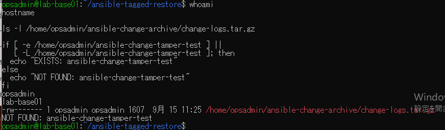
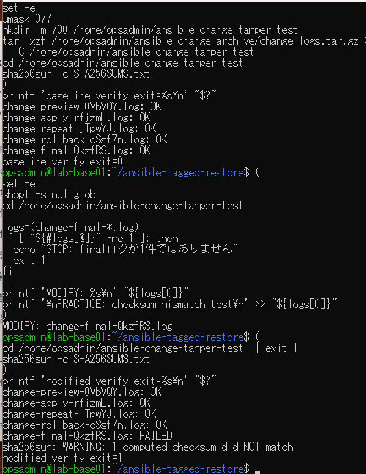
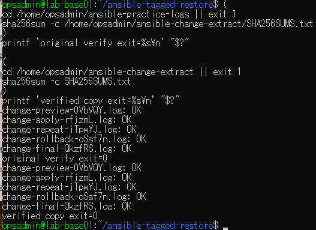

# ハッシュ不一致検出演習の原画像

[結果票](../../practice/2026-09-15-lab-base01-checksum-mismatch-practice.md)

本人提供画像3枚を無加工で保存。ユーザー名・ホスト名・パス・ログ名・サイズ・ファイル属性と検査結果を含む。
秘密鍵本文やパスワードは含まない。ログ・アーカイブ実体は添付しない。画像ハッシュはコピー一致確認用。

[元画像名・サイズ・SHA-256](manifest.json) / [SHA256SUMS](SHA256SUMS.txt)

## E01 試験先未使用と元アーカイブ

## E02 正常検査と1件の変更検出

## E03 元ログと検証済み展開先の一致

