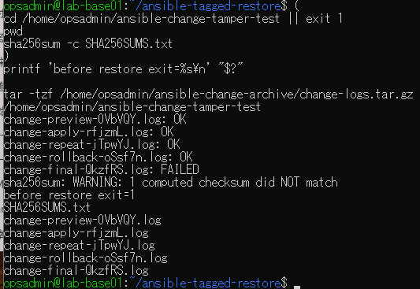
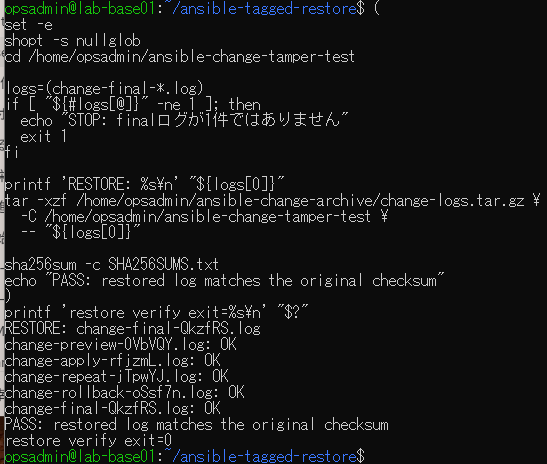

# 不一致ログ復元の原画像

[結果票](../../practice/2026-09-15-lab-base01-checksum-restore-practice.md)

本人提供画像2枚を無加工で保存。ユーザー名・ホスト名・パス・ログ名・検査結果を含む。
秘密鍵本文やパスワードは含まない。ログ・アーカイブ実体は添付しない。画像ハッシュはコピー一致確認用。

[元画像名・サイズ・SHA-256](manifest.json) / [SHA256SUMS](SHA256SUMS.txt)

## E01 復元前不一致とアーカイブ一覧

## E02 1件復元と5件一致

