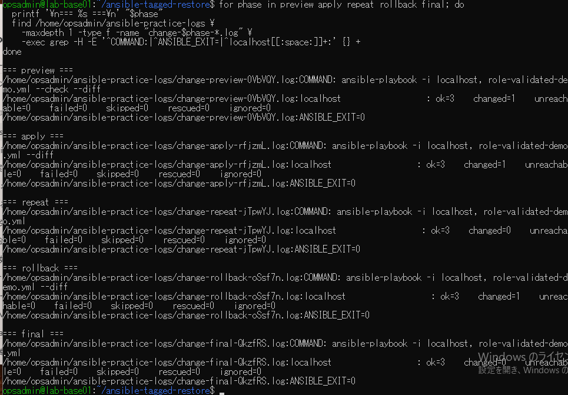

# 変更作業ログ照合の原画像

[結果票](../../practice/2026-09-15-lab-base01-cycle-review-practice.md)

本人提供画像1枚を無加工で保存。ユーザー名・ホスト名・パス・ログ名・コマンド説明と抽出結果を含む。
秘密鍵本文やパスワードは含まない。ログ実体は添付しない。画像ハッシュはコピー一致確認用。

[元画像名・サイズ・SHA-256](manifest.json) / [SHA256SUMS](SHA256SUMS.txt)

## E01 5段階のログ抽出

