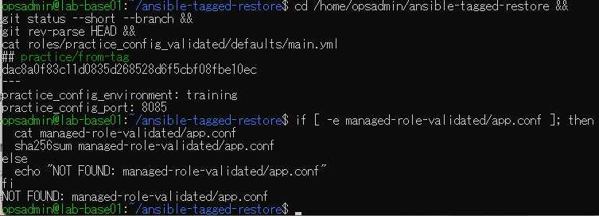
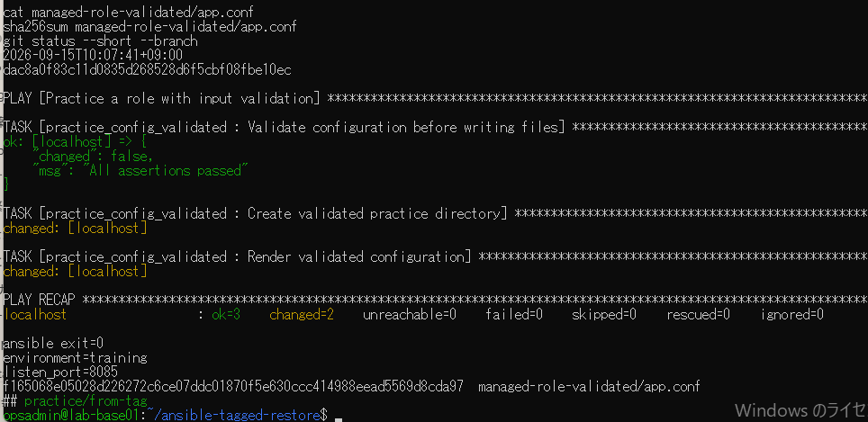
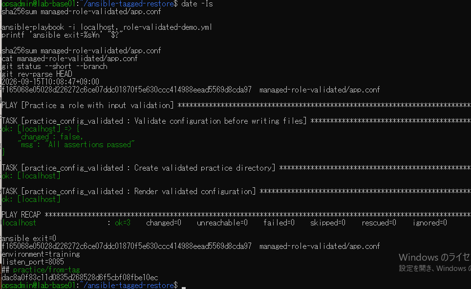

# 既定値8085検証の原画像

[結果票](../../practice/2026-09-15-lab-base01-default-8085-practice.md)

本人提供画像3枚を無加工で保存。ユーザー名・ホスト名・演習パス・日時・Git状態・SHA・設定本文を含む。
秘密鍵本文やパスワードは含まない。画像ハッシュはコピー一致確認用で、主体や日時の第三者認証ではない。

[元画像名・サイズ・SHA-256](manifest.json) / [SHA256SUMS](SHA256SUMS.txt)

## E01 保存版・既定値・出力未生成

## E02 training/8085の初回生成

## E03 上書きなし再実行とハッシュ維持

