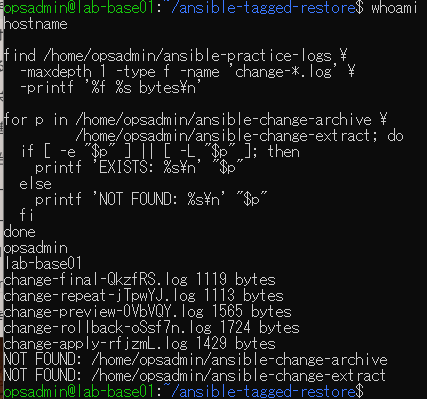
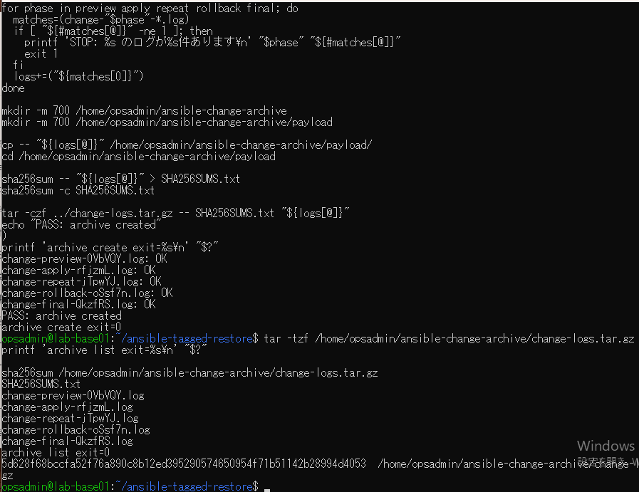
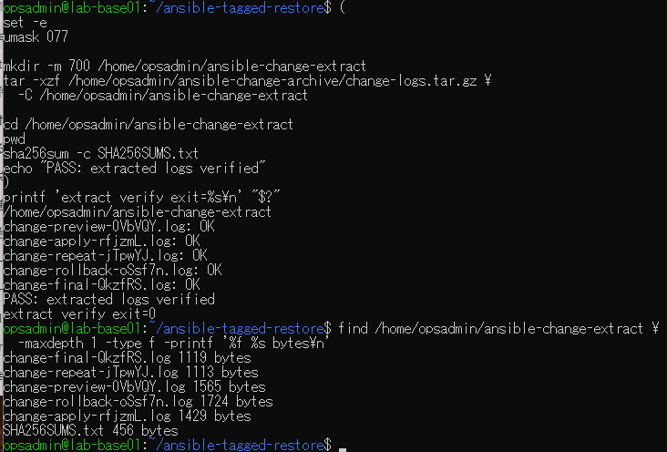

# ログアーカイブ演習の原画像

[結果票](../../practice/2026-09-15-lab-base01-log-archive-practice.md)

本人提供画像3枚を無加工で保存。ユーザー名・ホスト名・パス・ログ名・サイズ・アーカイブSHA-256を含む。
秘密鍵本文やパスワードは含まない。ログ・アーカイブ実体は添付しない。画像ハッシュはコピー一致確認用。

[元画像名・サイズ・SHA-256](manifest.json) / [SHA256SUMS](SHA256SUMS.txt)

## E01 5ログと保存先・展開先未使用

## E02 アーカイブ作成と収録一覧

## E03 展開後のハッシュ検証

