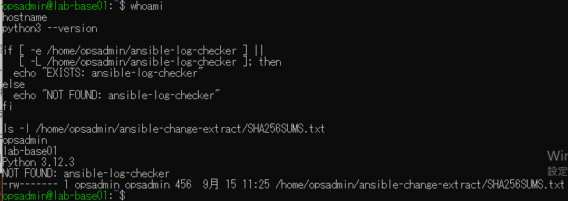
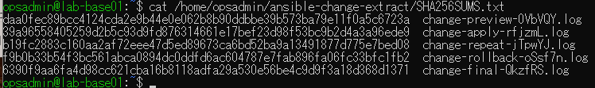
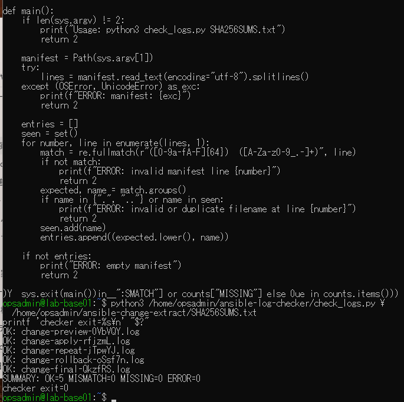
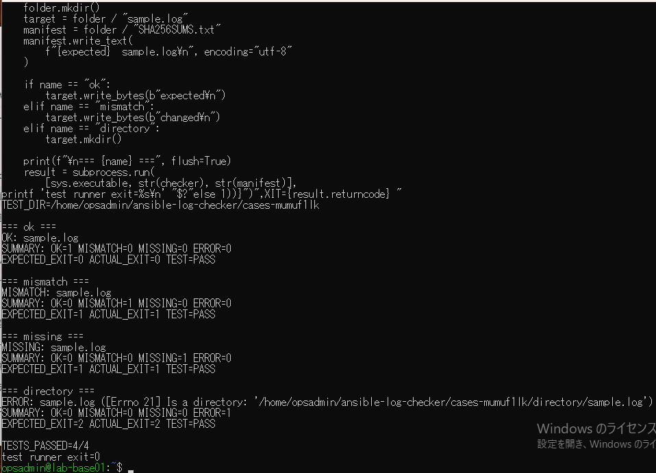

# ログ検証スクリプト演習の原画像

[結果票](../../practice/2026-09-15-lab-base01-log-checker-practice.md)

本人提供画像4枚を無加工で保存。ユーザー名・ホスト名・パス・ログ名・ハッシュ・Python版・コード断片・試験結果を含む。
秘密鍵本文やパスワードは含まない。画像ハッシュはコピー一致確認用。VM内スクリプト・ログ実体は添付しない。

[元画像名・サイズ・SHA-256](manifest.json) / [SHA256SUMS](SHA256SUMS.txt)

## E01 前提とPython版

## E02 既存ハッシュ一覧の形式

## E03 既存5ログの正常判定

## E04 専用データ4ケースの結果

