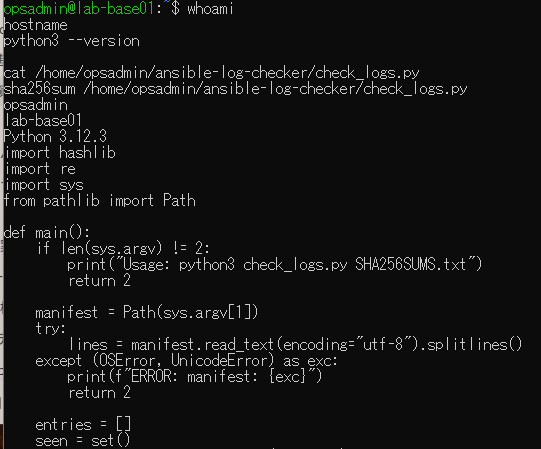
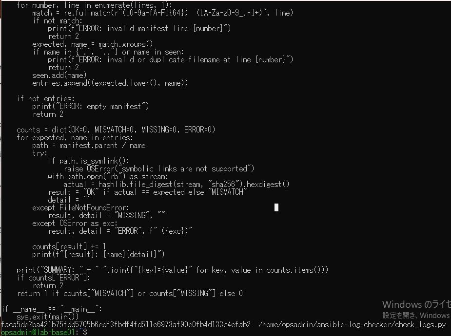
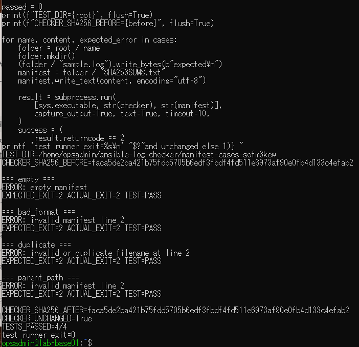

# 不正ハッシュ一覧検証の原画像

[結果票](../../2026-09-15-lab-base01-manifest-validation-practice.md)

本人提供画像3枚を無加工で保存。ユーザー名・ホスト名・パス・Python版・スクリプト本文・SHA・試験結果を含む。
秘密鍵本文やパスワードは含まない。スクリプト・試験データ実体は添付しない。画像ハッシュはコピー一致確認用。

[元画像名・サイズ・SHA-256](manifest.json) / [SHA256SUMS](SHA256SUMS.txt)

## E01 環境と実ソース前半

## E02 実ソース後半とハッシュ

## E03 不正一覧4ケースの結果

