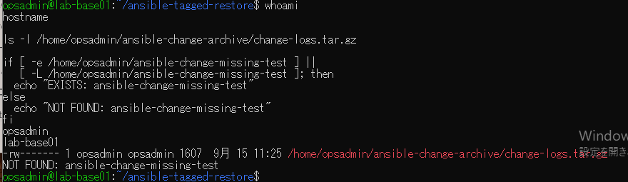
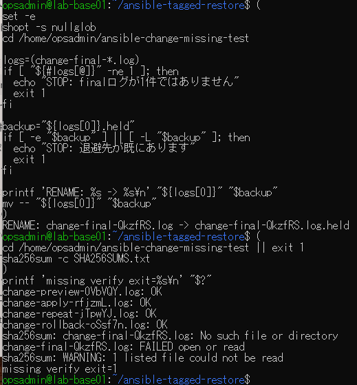
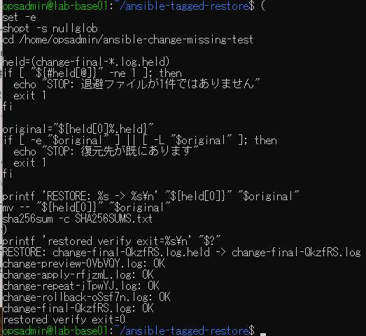

# ログ欠落検出・復帰の原画像

[結果票](../../2026-09-15-lab-base01-missing-log-practice.md)

本人提供画像3枚を無加工で保存。ユーザー名・ホスト名・パス・ログ名・ファイル属性・検査結果を含む。
秘密鍵本文やパスワードは含まない。ログ・アーカイブ実体は添付しない。画像ハッシュはコピー一致確認用。

[元画像名・サイズ・SHA-256](manifest.json) / [SHA256SUMS](SHA256SUMS.txt)

## E01 試験先未使用とアーカイブ

## E02 別名退避と欠落検出

## E03 元の名前へ戻して照合

