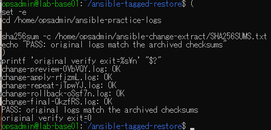

# 元ログ照合の原画像

[結果票](../../2026-09-15-lab-base01-original-log-check.md)

本人提供画像1枚を無加工で保存。VMユーザー名・ホスト名・パス・ログ名・照合結果を含む。
秘密鍵本文・パスワード・ログ実体は含めない。画像ハッシュはコピー一致確認用。

[元画像名・サイズ・SHA-256](manifest.json) / [SHA256SUMS](SHA256SUMS.txt)

