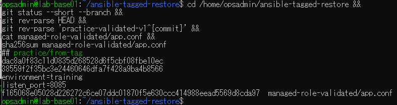
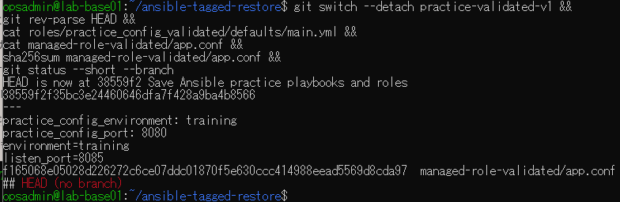
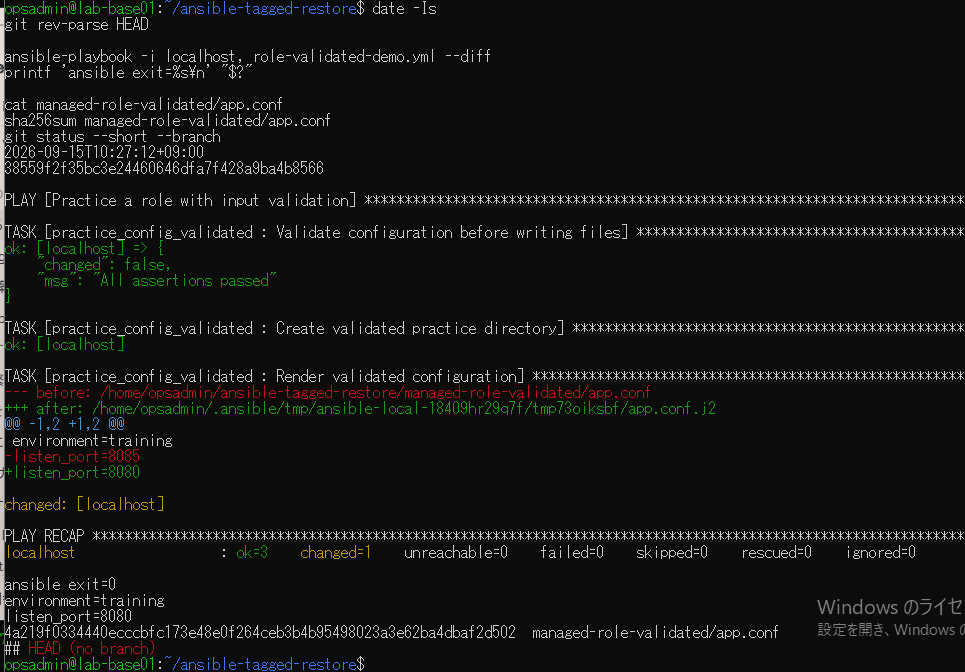
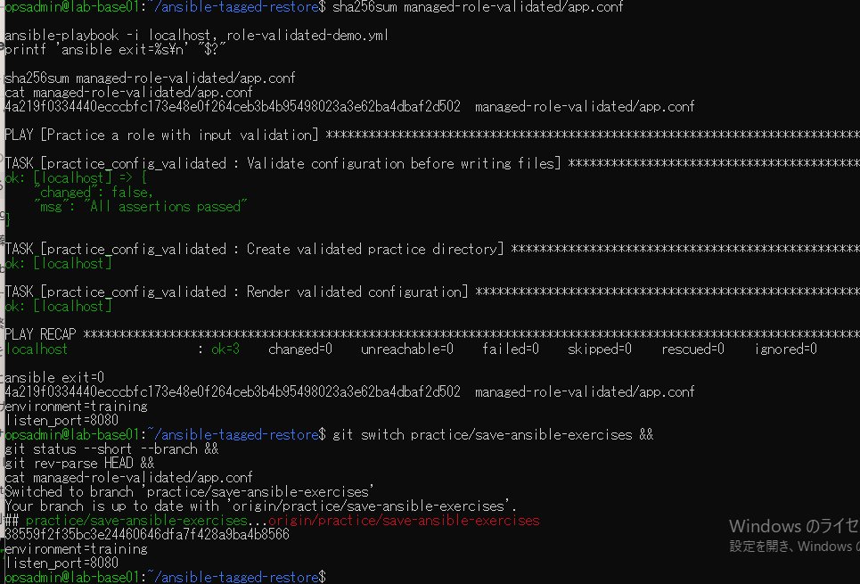

# タグ版への切り戻しの原画像

[結果票](../../2026-09-15-lab-base01-tag-rollback-practice.md)

本人提供画像4枚を無加工で保存。ユーザー名・ホスト名・演習パス・一時パス・日時・Git状態・SHA・設定本文を含む。
秘密鍵本文やパスワードは含まない。画像ハッシュはコピー一致確認用で、主体や日時の第三者認証ではない。

[元画像名・サイズ・SHA-256](manifest.json) / [SHA256SUMS](SHA256SUMS.txt)

## E01 変更版と生成済み8085

## E02 タグへ切替・生成物維持

## E03 旧版で8080を再適用

## E04 再実行と旧版ブランチ復帰

