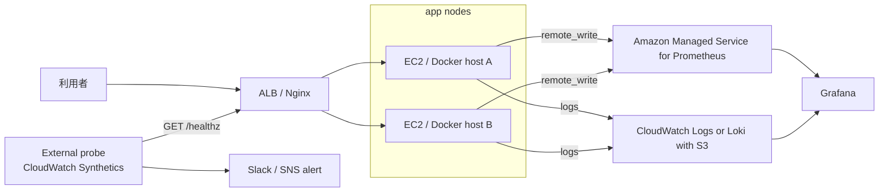

# 外部 probe / 中央 telemetry 設計

この文書は、単一ホストのラボ監視を「利用者視点で測れる本番相当 SLO」へ
近づけるための追加設計である。現時点では設計と採録手順であり、実際の
稼働証跡は [検証証跡台帳](../evidence/README.md) に記録する。

## 現在の制約

| 領域 | 現状 | 制約 |
| --- | --- | --- |
| `/healthz` probe | 同一 Compose ホストから監視 | ホスト停止を外側から検知できない |
| metrics | EC2 / Docker ホスト内 Prometheus | ホスト消失時に時系列の正本も失われる |
| logs | Loki + Grafana Alloy がローカル収集 | 複数ノード横断の検索・保持が弱い |
| SLO | ラボ内 SLI として定義 | ALB 外側からの可用性とは言い切れない |

## 追加構成

## 採用方針

| 領域 | 第一候補 | 理由 | 代替 |
| --- | --- | --- | --- |
| 外部 probe | CloudWatch Synthetics | AWS 証跡と Alarm の統合 | UptimeRobot |
| metrics 中央化 | AMP remote_write | Prometheus 互換を維持 | CloudWatch Agent |
| logs 中央化 | CloudWatch Logs | AWS 検証では証跡化しやすい | Loki + S3 backend |
| 可視化 | Grafana | 既存 dashboard を再利用できる | Amazon Managed Grafana |
| 通知 | SNS / Slack webhook | CloudWatch と Alertmanager の通知を揃えられる | Email |

個人検証で費用を抑える場合は、UptimeRobot + ローカル Grafana + CloudWatch Logs
から開始し、AWS 実適用時に CloudWatch Synthetics / AMP へ移行する。

## 証跡として残すもの

| 証跡 | 必須内容 |
| --- | --- |
| 外部 probe | 対象 URL、実行間隔、成功率、失敗時の通知スクリーンショット |
| metrics 中央化 | remote_write 設定、AMP / Grafana で見える時系列、対象 commit |
| logs 中央化 | Alloy 設定、ログ検索クエリ、マスク済みログ結果 |
| 障害試験 | probe 失敗時刻、Alert 到達時刻、復旧時刻、RTO |
| コスト | Cost Explorer の期間、サービス別費用、削除確認 |

## Definition of Done

- [ ] 外部 probe が対象ホスト外から `/healthz` を監視している
- [ ] probe 失敗が 2 分以内に通知される
- [ ] Prometheus の時系列がホスト外の保存先に送られている
- [ ] アプリログまたは Nginx ログをノード横断で検索できる
- [ ] 1 回以上、意図的な停止で検知から復旧までの時刻を採録している
- [ ] AWS 検証後に `terraform destroy` と費用を記録している
