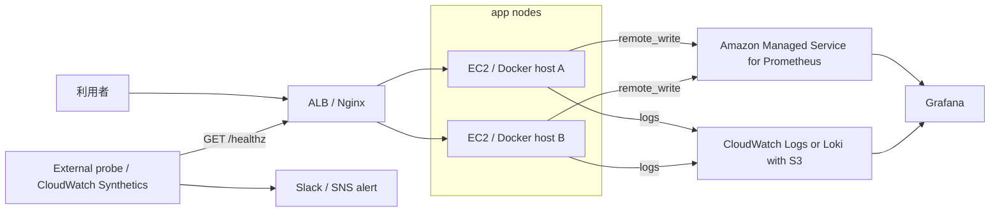

# 外部 probe / 中央 telemetry 設計

この文書は、単一ホストのラボ監視を「利用者視点で測れる本番相当 SLO」へ
近づけるための追加設計である。現時点では設計と採録手順であり、実際の
稼働証跡は [検証証跡台帳](../evidence/README.md) に記録する。

## 現在の制約

| 領域 | 現状 | 制約 |
| --- | --- | --- |
| `/healthz` probe | 同一 Compose ホストから監視 | ホスト停止を外側から検知できない |
| metrics | EC2 / Docker ホスト内 Prometheus | ホスト消失時に時系列の正本も失われる |
| logs | Loki + Grafana Alloy がローカル収集 | 複数ノード横断の検索・保持が弱い |
| SLO | ラボ内 SLI として定義 | ALB 外側からの可用性とは言い切れない |

## 追加構成

## 採用方針

| 領域 | 第一候補 | 理由 | 代替 |
| --- | --- | --- | --- |
| 外部 probe | CloudWatch Synthetics | AWS 証跡と Alarm の統合 | UptimeRobot |
| metrics 中央化 | AMP remote_write | Prometheus 互換を維持 | CloudWatch Agent |
| logs 中央化 | CloudWatch Logs | AWS 検証では証跡化しやすい | Loki + S3 backend |
| 可視化 | Grafana | 既存 dashboard を再利用できる | Amazon Managed Grafana |
| 通知 | SNS / Slack webhook | CloudWatch と Alertmanager の通知を揃えられる | Email |

個人検証で費用を抑える場合は、UptimeRobot + ローカル Grafana + CloudWatch Logs
から開始し、AWS 実適用時に CloudWatch Synthetics / AMP へ移行する。

## 証跡として残すもの

| 証跡 | 必須内容 |
| --- | --- |
| 外部 probe | 対象 URL、実行間隔、成功率、失敗時の通知スクリーンショット |
| metrics 中央化 | remote_write 設定、AMP / Grafana で見える時系列、対象 commit |
| logs 中央化 | Alloy 設定、ログ検索クエリ、マスク済みログ結果 |
| 障害試験 | probe 失敗時刻、Alert 到達時刻、復旧時刻、RTO |
| コスト | Cost Explorer の期間、サービス別費用、削除確認 |

## Definition of Done

- [ ] 外部 probe が対象ホスト外から `/healthz` を監視している
- [ ] probe 失敗が 2 分以内に通知される
- [ ] Prometheus の時系列がホスト外の保存先に送られている
- [ ] アプリログまたは Nginx ログをノード横断で検索できる
- [ ] 1 回以上、意図的な停止で検知から復旧までの時刻を採録している
- [ ] AWS 検証後に `terraform destroy` と費用を記録している

## 実装状況（2026-09-01）

外部 probe と metrics 中央化（表の 1〜2 行目）だけ、Terraform / Ansible の雛形を
`terraform/environments/staging` に追加した。**`terraform apply` は未実施**で、
このセクションの内容は設計から一歩進んだ「コード化された未検証の雛形」であり、
上記 Definition of Done のいずれも満たしていない。

| 領域 | 実装した雛形 | 未実施 |
| --- | --- | --- |
| 外部 probe | `terraform/modules/synthetics-probe`（CloudWatch Synthetics canary。`/healthz` を外部から30秒間隔でprobeし、失敗2分以内にSNS通知するCloudWatch Alarmを含む） | `terraform apply`、実際の通知到達確認 |
| metrics 中央化 | `terraform/modules/central-metrics`（AMP workspace + EC2 instance role用remote_write policy）、`ansible/roles/app/templates/prometheus.yml.j2` の `remote_write` opt-in化 | `terraform apply`、sigv4認証込みのremote_write到達確認 |
| logs 中央化 | 未着手（採用方針どおりCloudWatch Logsが第一候補） | 設計のまま |

有効化は `terraform/environments/staging/variables.tf` の
`enable_central_observability`（既定 `false`）を `true` にした場合のみ。
既存の dev/prod や Docker Compose lab には一切影響しない。

このセッションを実行したサンドボックス環境は `registry.terraform.io` への
egressが組織ポリシーでブロックされており（Docker Hub / deadsnakes PPA と同種の
制約）、`terraform init` でのprovider取得、`terraform validate`、`tfsec`、
`checkov` を実行できなかった。`terraform fmt` とモジュール単体のHCL構文、
Jinja2テンプレートのレンダリング（`remote_write`有効/無効の両方でYAMLとして
parse可能なことを含む）は確認済みだが、実際のAWS provider schemaに対する
検証はこのリポジトリのCI（`.github/workflows/terraform-check.yml`）が担う。
マージ後、最初のCI結果を確認するまでは `NOT RUN` として扱うこと。
