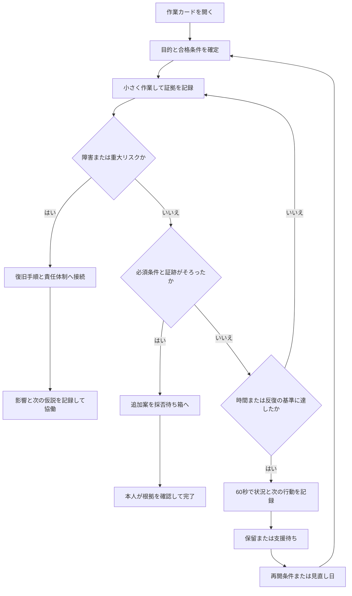

# サーバー構築エンジニアのための「手放して進める」運用設計

作成日：2026-09-05（日本時間）  
対象：ns7jp の個人学習・サーバー構築ポートフォリオ、および将来のチーム運用への適用設計  
状態：詳細設計・記入テンプレート・ローカル判定サンプルとCIを同梱。実サーバー・通知への接続、運用効果の測定は未実施。  
入口：[使い始める](README.md)／[記入用テンプレート](templates.md)／[根拠と確認範囲](evidence.md)

## 1. この仕組みが作る状態

**「まだ気になる」と感じていても、目的・証拠・次の確認時点が決まっていれば、その日の作業を安全に終えられる状態を作る。**

ここでいう「執着」は診断名ではない。完成後も直し続ける、同じ画面を何度も見る、方法を変えられない、全部自分で抱える、比較から予定を増やす、といった仕事上の行動を指す。感情そのものを自動消去できるとは考えない。自動化するのは、きっかけを見つけて次の小さな行動を示す部分である。

本設計での「最高のサーバー構築エンジニア」は、際限なく作業する人ではなく、次を再現できる人と定義する。

1. 利用者に必要な状態を、作業前に言葉と試験へ変える。
2. 安全・権限・データ・復旧を守り、変更を小さくする。
3. 結果を日時・対象・版・環境とともに残す。
4. 合格した仕事を閉じ、追加改善を別の判断に回す。
5. 自分が離れても再開できる手順と責任の所在を残す。

「責任を果たす」と「気が済むまで続ける」を、完了条件によって区別する。気分を採点したり、他人を執着の強い人と分類したりしない。

## 2. ns7jp の資産にどう接続するか

主な適用先は [ns7jp/server](https://github.com/ns7jp/server)。今回の読取確認で参照した main は `44c52e733826b9b5239918c05010b8b68b60346c`。通常のWeb表示には古い紹介文が残る場合があるため、技術上の接続先はコミット固定資料で確認する。公開紹介にある過去のPASSを、現在の全環境の合格へ読み替えない。

| 既存の流れ・資産 | 加える判断 | 手放せる行動 |
|---|---|---|
| 要件・設計・変更管理 | 目的、対象外、合格条件を着手前に固定 | 作業中の際限ない要件追加 |
| Ansible・Docker等の構築 | 一度に変える仮説を1つにする | 根拠なくコマンドを追加すること |
| 試験・Actions・証跡 | 対象、版、環境、目的が同じ確認を識別 | 同じ成功画面を安心のために再確認 |
| SLO・監視 | 利用者への影響と、次の対応がある通知を重視 | グラフを常時見続けること |
| 復旧・ロールバック | 戻す条件と責任者を先に決める | 自案を守るための無理な修正継続 |
| 引継ぎ・学習記録 | 次の人が使える最小情報を残す | 自分だけが分かる状態の維持 |
| 初回の app／nginx 実習 | 最小ゴールを達成したら初回を閉じる | 監視・AWS・別OSまで同時に広げること |
| プロフィール・公開サイト | 説明は主作品の正本を参照 | 同じ実測値を各所で何度も手直し |

実習の入口は既存の [初心者向けガイド](https://github.com/ns7jp/server/blob/44c52e733826b9b5239918c05010b8b68b60346c/docs/beginner-learning-guide.md) を使う。新しい学習体系へ全移行する必要はない。

## 3. 最初に採用する5つの規則

| 規則 | 日常の実装 | 例外の扱い |
|---|---|---|
| 着手中は原則1件 | 今日の作業カードを1枚開く | 障害割込み時は元の作業を保留し、再開条件を残す |
| 完了条件は先に書く | 必須の安全・動作・復旧・説明を列挙 | 新しいリスク発見なら変更理由を記録して追加する |
| 同じ確認を続けない | 同一条件で再確認したら「何が変わったか」を書く | 変更、異常、証跡の期限切れ、別環境は再確認の正当な理由 |
| 改善案は採否待ち箱へ | 必須条件外の案を1行保存する | セキュリティ・データ保全に関わる新事実は直ちに再判定 |
| 閉じるときは次回条件を残す | 完了／保留／支援待ちを選び、根拠を1行残す | 未実施や障害を完了と記録しない |

初期値は通常作業45分、同じ条件の再確認2回、根拠が増えない試行2回、週次レビュー10分とする。**これは本設計の試行用設定であり、研究で保証された値や本番のSLAではない。** 実作業に合わなければ、原因を見て1つずつ変える。組織の対応期限・変更手順・オンコール体制がある場合はそちらを優先する。

## 4. 全体構造：観測から終了まで



人が持つ作業状態は4つでよい。

| 状態 | 意味 | 次へ進む条件 |
|---|---|---|
| 作業中 | 目的と次の操作が決まっている | 必須条件の合格、停滞、時間、割込みを観測 |
| 保留 | 未完だが今は作業しない | 指定した事実・期限・環境がそろう |
| 支援待ち | 判断・権限・知識が足りない | 支援や引受けの受領を確認する |
| 完了 | 今回の範囲で必要な条件を満たした | 新事実が出れば新しいカードで再評価 |

「終了候補」は機械からの提案であり、作業状態の完了とは異なる。タイマーが鳴っただけでは、どの操作も完了しない。

## 5. 着手前の3分で決める契約

作業カードに次の7点を書く。すでにIssueや変更票があるならリンクと不足分だけでよい。

1. **目的**：誰が何をできればよいか。例「学習用Web入口で、正常応答と認証の働きを説明できる」。
2. **対象**：リポジトリ、ブランチ／コミット、環境、対象サービス。未コミット差分があるならその識別も残す。
3. **範囲と対象外**：今回はapp／nginx。監視スタックの追加とAWS構築は対象外。
4. **合格条件**：必要なHTTP応答、認証、停止・再開、秘密情報、記録を条件化する。
5. **中断・復旧条件**：意図しない公開、データへの影響、想定と違う対象、復旧できない変更があれば追加変更を止めて手順を確認する。
6. **作業予算**：45分などの見直し時点。長い試験は想定所要時間を先に変更する。
7. **次の確認時点**：必要な確認の完了時、タイマー時、異常発見時。常時確認しない。

完了条件は「できるだけ良く」「問題がなさそう」では判定できない。「指定の環境で、指定の試験の期待値と実測値が一致し、証跡がある」に直す。無関係な新要件で後から合格条件を動かさない。

## 6. 必須品質を守る4つの判定枠

| 判定枠 | 学習ラボでの例 | 業務へ広げるときの追加条件 |
|---|---|---|
| security：安全・権限・秘密・データ保全 | 対象が使い捨てラボ、必要な認証、秘密の追跡除外、意図しない外部公開なし | 権限、接続経路、バックアップ、組織の変更・セキュリティ条件 |
| functional：必要な動作 | 健全性応答、認証前後の期待応答 | 要件に対応する試験、必要な性能・接続・互換性 |
| recovery：戻し方・再開 | 計画停止と再開を確認し記録 | 影響に応じたバックアップ復元／ロールバックの試験と責任 |
| handover：記録・説明 | 自分の言葉の説明、次回コマンドと期待結果 | 引受先の受領、連絡経路、権限、未解決事項の合意 |

この4枠はチェック項目の分類である。具体的な試験は作業ごとに記入する。ラボの自己説明を、第三者の引継ぎ試験に置き換えてはならない。

各枠は `PASS`、`FAIL`、`NOT_RUN`、`NA` のどれかにする。

- `PASS`：今回の対象・版・環境で必要な確認を実行し、根拠を記録した。
- `FAIL`：確認を実行したが合格しなかった。
- `NOT_RUN`：未実施、証拠が足りない、まだ確認していない。
- `NA`：今回の範囲に適用しない。理由と対象外と判断した根拠が必要。

`NA` は面倒な確認を避けるための値ではない。必須の安全条件を解除する根拠にもならない。試験ごとに適用可否を先に判断する。未実施を空欄やNAに変えて通過させない。

1つの枠に複数の試験をまとめる場合は、適用する必須試験がすべて合格した場合だけ枠をPASSにする。1件でもFAIL・NOT_RUN・証跡不足があればPASSにしない。FAILがあれば枠はFAIL、それ以外の未実施・証跡不足はNOT_RUNとし、内訳を証跡に残す。枠全体のNAは、含まれる必要確認がすべて適用外と根拠付きで判断された場合だけ使う。判定CLIはこの内訳の真実性を検査できない。

証跡には、記録ID、日時、環境、対象の版、操作、期待値、実測値、結果、保存先、限界を付ける。同じコミットでも設定や環境が違えば使い回せない。未コミット変更を含む場合はコミットに加えて差分のハッシュ等で識別する。CLIサンプルの `revision` は、この対象状態を一意に表す文字列として扱う。

## 7. 執着を次の60秒行動へ変える表

本人が「いま執着しているか」を正確に判定する必要はない。次の観測可能な出来事を合図にする。60秒は記録と分岐を選ぶ時間であり、サーバー停止・削除・切替の実行期限ではない。

| 合図 | 60秒以内に行うこと | その後 | 再開する条件 |
|---|---|---|---|
| 合格後に文章や構成をもう一度直したい | 改善案を1行で採否待ち箱へ移す | 今回の成果を閉じる | 新しい要件、誤り、実害、採用判断 |
| 同じActions画面を2回開き直す | 最後のrunと結果を参照し「新しい事実」を1行書く | 事実がなければ画面を閉じる | run完了、失敗、head更新など |
| 同じコマンドを根拠なく繰り返す | 仮説と今回変える変数を1つ書く | 書けなければ切り分け方を変える | 検証できる新しい仮説 |
| 新ツールの検索が始まる | 現在の道具では満たせない要件を書く | 不足がなければ保留 | 必要性・試験・撤去方法がそろう |
| 他人のリポジトリを見て全面改修したくなる | 自分の現在の課題との接点を1行書く | 今の作業へ戻る | 週次レビューで採用する |
| これまでの投入時間を理由に続ける | 続行・縮小・撤退の今後の負担を比較 | 将来の効果と戻しやすさで選ぶ | 新しい条件や制約が変わる |
| 資格・バッジ・スター・技術数を増やしたくなる | 説明できるようになる1つの課題へ置き換える | 1分説明を録音または記述 | 説明や検証の不足が具体化する |
| 自分しか分からず休めない | 目的・現状・証拠・次の仮説・必要支援を書く | 引継ぎ先の受領を確認 | 支援・引受けが成立する |
| AIから改善案が大量に出る | 元の依頼の必須項目と新規提案を分ける | 新規提案だけ採否待ち箱へ | 本人が採用を決める |
| レビュー指摘に即座に反論したくなる | 指摘を要件・事実・提案に分ける | 必須違反は直し、選好は根拠を比較 | 検証結果や意思決定者の判断 |
| 不安から休日にダッシュボードを見る | 担当時間と通知・点検の取り決めを確認 | 次の予定確認へ戻す | 担当中の実アラート、合意済み点検 |
| 未完了項目が多く、全部やり直したい | 今日の目的に直結する1件を選ぶ | 残りの再開条件を残す | 優先順位の見直し時 |

既存の依頼に必要な修正・検証まで「採否待ち」にして止めない。保留するのは範囲外の追加案である。期限・安全・契約上の必須項目は、そのまま必要な仕事として扱う。

## 8. 60秒の固定手順「事実・目的・移す・閉じる」

**0〜15秒：事実を書く。**「同じ成功runを再表示した」「新しい変更はない」。自分を評価する言葉は書かない。

**15〜30秒：目的を読む。** 作業カードの合格条件へ戻る。「この確認で、どの未達条件を解決するか」を見る。

**30〜45秒：次の行動を選ぶ。** 未達条件に効くなら継続。新しい安全リスクなら対応へ。範囲外なら採否待ち箱。根拠が不足なら支援待ち。

**45〜60秒：閉じ方を残す。** 証拠、保留理由、再開条件のいずれかを1行記録し、作業状態を更新する。画面を閉じる場合も、その前に未完の操作や稼働資源の状態を確認する。

覚える文は **「気になることは保存する。実行することは条件で選ぶ。」** とする。記録の文章を整えることに時間を使わない。

## 9. 自動判定の優先順位

判定は次の上位条件から行う。終了や速度より、安全と証跡の成立が先である。

| 優先 | 条件 | 判定 | 提示する行動 |
|---|---|---|---|
| 1 | 障害モード、または重大リスクを観測 | COORDINATE | 既存の復旧・連絡体制へ接続し、影響と仮説を整理 |
| 2 | 入力の欠測・不正 | NEEDS_INPUT | 欠測を補う。成功を推測しない |
| 3 | 4枠の有効な根拠がそろい、新事実が未反映でない | READY_TO_CLOSE | 本人が内容を確認し、追加案を分けて作業を閉じる |
| 4 | 未達があり、見直し時間に達した | PAUSE_AND_RECORD | 対象の安全な状態を確認し、残課題と再開条件を記録 |
| 5 | 新事実なしの同一確認2回、または仮説が増えない試行2回 | CHANGE_APPROACH | 5行の切り分け記録を作る、資料へ戻る、支援を求める |
| 6 | 新事実があり、証跡へ未反映 | CONTINUE | 新事実を試験と根拠へ反映し、再評価 |
| 7 | その他 | CONTINUE | 次の未達条件に対応する1操作を行う |

再確認回数は「対象・版・環境・確認目的が同じで、関連する新事実がない確認」の回数に限る。開始時の確認、必要な定期測定、別環境試験、変更後の回帰試験は数えない。

完了後に再開するのは、新しい不具合、変更、証跡の有効期限、セキュリティ情報、利用者要件などがあるとき。「落ち着かない」は保存できるが、それだけで本番変更へは進めない。

## 10. 自動化するものと、人が担当するもの

| 層 | 仕組み | 今回の提供状態 |
|---|---|---|
| 作業前 | 作業カードから目的・予算・判定枠を読む | 記入テンプレートを作成 |
| 作業中 | タイマー、CI完了等のイベントで見直しを促す | 接続設計。タイマーや通知の設定は未実施 |
| 判定 | 入力した事実から次の行動を提示する | Node.jsのローカルCLIを実装 |
| 記録 | 保留、終了、次の仮説を短く残す | 記入テンプレートを作成 |
| 週次 | 期限・再開条件を見て保留項目を再提示 | 手動運用手順。常駐・定期実行は未設定 |
| 実サーバー | デプロイ、復旧、停止、権限変更 | 本キットからは実行しない |
| 意思決定 | 採用、残リスク受容、引継ぎ受領、公開 | 本人または既存の責任者が判断 |

CLIは心理状態、実サーバー、ログ内容を読まない。入力欄にPASSと書かれたことと、本当に試験が通ったことを区別する。作業状態やIssueを自動変更する機能も持たない。

完全な自動運用に進む際には、収集部分を別に追加する。各試験結果を対象の版・環境・証跡に結び付け、権限と情報の扱いを決めたうえで、読み取りから導入する。単に入力値を自動でPASSにする実装は採用しない。

## 11. GitHubに接続する実装設計

文書と判定サンプルは `docs/work-completion/` に配置し、README・初心者ガイド・変更管理から参照する。判定の42テストは `.github/workflows/work-completion.yml` で実行する。以下のIssue／PR項目、通知、情報収集、必須チェック設定は今後の接続設計であり、このキットの導入だけでは有効にならない。

### 11.1 正本を1か所にする

`server` に工程の正本を置き、プロフィールと公開サイトはそこへリンクする。候補配置は次のとおり。既存の変更管理・証跡台帳が同じ役割を持つ場合は、その文書へ追記して重複を避ける。

```text
server/
  docs/change-management.md       # 合格・中断・追加提案の規則を接続
  docs/evidence/                  # 既存の証跡保存方針に従う
  .github/                       # 既存テンプレートに必要項目だけ追加
  scripts/                       # 読取用判定を採用する場合の候補
```

Issueには「目的／必須条件／対象外／戻し方／見直し時点」を追加する。PRには「元の範囲の達成／試験の対象版／未実施／追加案の保存先」を付ける。新規のラベル群やProjectは最初から必須にしない。

### 11.2 CIを見続けなくてよい条件を作る

1. 必須チェックを変更種類ごとに定める。文書のリンク検査と、構築・復旧の実行試験は別の結果として扱う。
2. 現在のPRのheadに対応するrunの完了を確認する。過去runの成功を引き継がない。
3. 保護設定／ルールセットによる必須チェックが実際に有効か確認する。テンプレートのチェック欄だけでは強制できない。
4. 失敗・完了・人の判断が必要な状態の変化を受け取り、同じ状態で通知を繰り返さない。
5. 受信を一度試してから、手動で画面を見続ける運用を減らす。通知が使えない場合は決めた時刻に確認する。

GitHub Actionsのconcurrencyは同時実行を制御できる。PR単位の検査で古い実行を止める設計は候補になるが、デプロイや復旧の途中キャンセルとは分離して検討する。既存の処理を確認してから適用する。[GitHub公式資料](https://docs.github.com/en/actions/how-tos/write-workflows/choose-when-workflows-run/control-workflow-concurrency)

### 11.3 通知を増やしすぎない

接続時のイベントIDは、対象・版・イベント種類・状態を組み合わせる。同じID・状態の繰り返しは集約し、状態が変われば再提示する。個人の作業見直し通知の抑制と、障害アラートの繰り返し・エスカレーションを混同しない。未受領の障害通知は既存の当番ルールに従う。

GitHubへ公開する記録は技術的な事実だけにする。個人的な感情・比較相手・生活状況の記録が必要なら私的なノートへ分ける。認証情報、内部ホスト、トークンをログや入力JSONへ書かない。

### 11.4 現行資産をつなぐ前に確認する4点

- **SLOの条件**：現行文書の予算80%超での変更停止と、ルールの消尽通知 `>=1` は異なる条件である。停止判断と通知の役割、欠測・計画停止の計算をそろえてから自動判定へ接続する。
- **初回実習の対象**：通常の日次点検はCompose全体を前提にする箇所がある。app／nginxだけの実習では対象サービスを明示し、後続サービスの未起動を今回の不合格と混同しない。
- **成功の読み方**：点検の終了コード0にSKIPが含まれ得る。必須項目の実施結果を読む。受入チェックと日次点検の役割も区別する。
- **GitHubの強制力**：確認時のbranch APIは `protected:false` を返した。これだけで全ルールセットの有無までは断定できない。組込み時に有効なルールと必須チェックを別途確認する。

これらは接続時の確認事項として採否待ちに置く。本キットの導入では既存のサーバー設定・監視設定を変更せず、未実施試験の代行も行わない。確認元は [根拠と検証](evidence.md) にまとめた。

### 11.5 自動化を止める条件

誤った終了候補、通知の欠落、古い版の結果利用、秘密情報の混入が発生したら、その連携を無効化して作業カードの手動運用へ戻す。既存の試験や監視は継続する。自動化は、週次記録で削減時間が維持負担を上回るか確認してから拡張する。

## 12. SLOと監視を「安心のための常時確認」から離す

SLOはサービスの目標、SLIはその測定値、エラーバジェットは目標に対して許容される不成功分である。例えば、要求ベースの成功率99.9%を100万要求で評価する仮例なら、不成功の予算は1,000要求になる。これは説明例であり、ns7jp の採用値や実測値ではない。

Google SREの例では、エラーバジェットの消費状況で通常変更と信頼性改善の優先を切り替える。今回の設計ではこの考え方を、「気になったから変更」から「合意した指標と条件で変更」へ移す参考にする。[Google SRE：Error Budget Policy](https://sre.google/workbook/error-budget-policy/)

| 状況 | 次の行動 |
|---|---|
| 指標が目標内、通知経路も確認済み | 次の合意済み点検まで現在の作業へ戻る |
| 指標が境界へ接近 | 定義した調査・改善カードへ進む |
| 目標違反、利用者影響、重大なリスク | 既存の障害・変更停止ルールへ進む |
| 指標が欠測、通知経路が未確認 | 正常とみなさず、観測を回復する仕事を登録 |

SLOを満たしていても、認証漏れやデータ破損など別の必須条件を無視できない。ラボに継続観測がない場合は可用性を達成済みと書かず、「単発の試験を実行した」と記録する。

監視では、何を見ればどの行動をするかが分かる通知を優先する。Google SREも、人が画面を見続けることに依存する監視を避け、通知の信号と雑音を重視している。[Google SRE：Monitoring Distributed Systems](https://sre.google/sre-book/monitoring-distributed-systems/)

## 13. 具体例：app／nginxの初回実習を閉じる

これは既存ガイドに接続する**記入例**であり、今回この実習を実行したという記録ではない。

**目的**：学習用Webの入口と認証を小さく動かし、動作・停止・再開を説明する。

**環境**：既存ガイドが指定する使い捨てUbuntu環境。Bashの手順をWindows PowerShellへそのまま貼り付けない。サービスや秘密値の準備はガイドに従う。

**今回の範囲**：appとnginx。監視全体、Terraform、AWS、別OSへの展開は別回。

**完了条件の例**：

1. 対象・認証・秘密値の保存と追跡除外を確認する。
2. `/healthz` が期待する200を返す。
3. 未認証の保護ページ／metricsが期待する401、認証付きAPIが期待する200を返す。
4. ガイドに沿った計画停止と再開を確認する。
5. 日時・版・環境・結果を記録し、「入口・認証・止め方」を自分の言葉で説明する。

**開始から終了までの想定例**：

| 時点 | 出来事 | 行動 |
|---|---|---|
| 開始 | 作業カードを作る | 試験と45分の見直しを設定 |
| 途中 | healthzが200 | この試験の根拠を保存し、次の未達条件へ |
| 途中 | Grafanaも加えたくなる | 「次回：監視を加える目的」を採否待ち箱へ |
| 終盤 | 必須条件がすべて通る | 結果と説明を確認して今回を閉じる |
| 別の分岐 | 45分でも認証確認が未実施 | 安全に保留できる対象状態を確認してからNOT_RUNのまま保留。原因と再開条件を残す。安全状態を確認できなければリスク対応・連携へ |
| 別の分岐 | 意図しない外部公開を見つける | 時間に関係なくリスク対応へ移る |

学習のための終了操作とデータを消す操作を混同しない。既存ガイドの停止方法に従い、気分を切り替える目的でボリュームや証跡を削除しない。

この1回の完成は「最小構成を確認した」という完成であり、監視全体・実務経験・本番運用・本人の全技術習得の証明ではない。

## 14. 具体例：障害対応で方法への執着を手放す

想定：アプリが応答しない。同じ再起動を繰り返したくなる。

1. 障害の開始時刻、影響、担当、直前の変更を記録する。
2. 利用者影響を抑える既存の復旧手順を確認する。推測で削除や大きな変更を足さない。
3. 「再起動で何が変わるか」「結果から次に何が分かるか」を書く。
4. 仮説や証拠が増えない試行が続いたら、入口・プロセス・依存先など切り分けの観点を変える。
5. 支援が必要なら、5行の記録を使って担当者へ相談する。送信や担当変更は既存の権限と連絡手順で行う。
6. 引受先の受領を確認するまで、担当がいなくなったものとして扱わない。
7. 復旧確認と残リスクを記録してから障害状態を解除する。原因究明や恒久対策は、復旧を妨げなければ別カードへ分ける。

ここで手放すのは、自分の最初の仮説への固執や単独での抱え込みである。対応時間が来たことは、サービス放置や未確認の復旧宣言の理由にならない。個人ラボで相談先がいない場合も、稼働・停止・残課題を記録し、再開手順を残す。

## 15. 技術選定と過去投資を切り離す

候補を調べる前に、今の課題と採用条件を書く。最初は既存方式を含む2候補で足りる。

| 比較項目 | 既存方式 | 新方式 |
|---|---|---|
| 必須要件を満たすか | 証拠／未確認 | 証拠／未確認 |
| 次の1週間で得られる効果 | 対象と期待効果 | 対象と期待効果 |
| これから必要な作業 | 検証・維持・引継ぎ | 移行・検証・維持・引継ぎ |
| 戻す負担 | 手順と制約 | 手順と制約 |
| 説明できるか | 1分説明で確認 | 1分説明で確認 |

過去に費やした時間は履歴として残すが、今後の継続理由から外す。新技術の追加は「不足する要件」「小さな試験」「採用／撤退条件」がそろってから判断する。採用した場合も、旧方式をただちに消すのではなく、移行と復旧を確認する。

学習用の試行そのものに価値がある場合は、それを目的に書けばよい。新技術の試用を、本番で必要な構成だったことに置き換えない。

## 16. 保留箱を墓場にしない

採否待ち箱は、改善案を忘れないための置き場である。作業の追加を自動で決定する場所にはしない。

各項目は「案・今やらない理由・再開条件・見直し日」の4点から始める。期限がある項目には元の期限と変更履歴を残す。見直した日へ元期限を上書きして遅延を消さない。

週次レビューで、本人が採用／保留継続／見送りを選ぶ。期限到来は再提示の合図であって、自動採用・自動削除・自動クローズの合図ではない。必須項目を見送る場合は、目的・対象範囲・責任者の判断を先に見直す。

保留が大量なら、最初から精密な評価表を作らず、直近の目的に関係する項目だけ確認する。まだ見ていない項目は「未確認」と残す。

## 17. 日次・週次の運用

### 日次：開始3分、終了2分

開始時は目的1つ、必須条件、見直し時点を読む。終了時は、今日進んだ事実、未完、次回の最初の1操作を記録する。すでに試験ログがある部分はリンクだけでよい。

### 週次：最初は10分

1. 必須確認を省いてしまった作業がないか見る。
2. 重複確認や範囲追加が起きた作業を1件選ぶ。
3. 保留の再開条件・期限を確認する。期限超過の理由を残す。
4. 来週変える規則を1つだけ選ぶ。
5. 追加の管理作業が負担なら、記録項目や通知を減らす。

Google SREのtoilの整理は、繰り返しの作業を改善対象として見つける参考になる。ただし、初めての学習や必要な試験を、単に時間がかかるから無駄と判定しない。[Google SRE：Eliminating Toil](https://sre.google/sre-book/eliminating-toil/)

## 18. 効果の測り方

最初の3作業を現状の記録、次の5作業を試行として比較する。これは個人の運用改善用であり、因果効果を証明する実験ではない。作業の難しさや環境が違う場合はその違いも残す。

| 指標 | 数え方 | 避ける誤解 |
|---|---|---|
| 必須確認の遵守 | 終了した作業のうち、事前条件と有効な証跡がある件数／確認した終了件数 | 未実施をPASSに変えて達成しない |
| 余分な再確認時間 | 新事実なしの同条件確認に使った概算分 | 必要な回帰試験を減らす目標にしない |
| 完了後の予定外延長 | 合格後に範囲外作業を続けた概算分 | 合格後に発見した重大リスクの対応は分ける |
| 管理の負担 | この仕組みへの記入・判定・整理に使った概算分 | 測定そのものへ時間をかけない |
| 保留の回復 | 再開条件が成立した項目のうち、再評価できた件数 | 未確認の項目を見送り扱いにしない |

分母が0なら割合は「対象なし」。記録がなければ「欠測」。記録を後から推測して埋めない。速さだけで良否を決めず、手戻り・必要試験の省略・引継ぎ不能が増えていないかを見る。

採用判断の目安は、必要な品質を守りながら、余分な再確認か延長が減り、記録の負担が許容範囲かどうか。初期の目安を機械的なノルマにしない。効果がなければ道具を増やす前に規則を減らす。

## 19. 2週間の導入計画

| 期間 | 実施内容 | 確認すること |
|---|---|---|
| 1日目 | 本書の規則を確認。カード1枚と採否待ち箱を準備 | 3分程度で着手条件を書けるか |
| 2〜4日目 | 普段の3作業を記録する | どの場面で再確認・延長が起きるか |
| 5〜10日目 | 5作業でタイマーと60秒手順を試す | 必須確認を守りつつ切替できるか |
| 11日目 | 未実施・失敗・時間切れ・障害の架空例で判定CLIを確認 | 時間切れが完了にならないか |
| 12日目 | 既存Issue／PRの不足項目だけ整理 | 二重入力を増やさず接続できるか |
| 13日目 | 私的記録、公開用証跡、通知内容を区分 | 公開不要な情報が混ざらないか |
| 14日目 | 数値と負担を本人が評価 | 継続・簡素化・停止のいずれかを決める |

作業記録の自動収集や定期通知などの実運用連携は、試行結果を見て導入する。2週間という長さも試行案であり、成果の保証ではない。

## 20. 受入条件と確認範囲

| ID | 必須要件 | 確認方法 |
|---|---|---|
| REL-01 | 感情入力なしで次行動を選べる | テンプレートとCLI入力の確認 |
| REL-02 | 未実施・失敗・欠測は終了候補にならない | 判定テスト |
| REL-03 | 古い対象版の証拠で終了候補にならない | 判定テスト |
| REL-04 | 時間切れは保留・記録を促す | 境界値テスト |
| REL-05 | 障害・重大リスクは最優先 | 優先順位テスト |
| REL-06 | 範囲外の追加案を保存できる | 採否待ち箱テンプレート |
| REL-07 | 保留に再開条件と期限履歴がある | 保留カードテンプレート |
| REL-08 | 自動判定で外部変更・承認をしない | コード読取・実行確認 |
| REL-09 | 例・実装・実測・未実施を区別する | 文書と検証記録 |
| REL-10 | 既存文書から参照し、正本を増やしすぎない | README・初心者ガイド・変更管理からの導線を追加し、ローカルリンクを確認 |

ローカルのテスト合格は、入力に対するプログラム分岐の確認である。本人の行動改善、サーバーの品質、本番の安全性、GitHubの強制設定、通知の到達を証明しない。確認できたものだけを [根拠と検証](evidence.md) に記録する。

日常に戻すときは、まずこの1行を使う。

> 今日の目的を1つ決める。合格条件まで確認する。気になる追加案は保存する。証拠と次回条件を残して閉じる。
