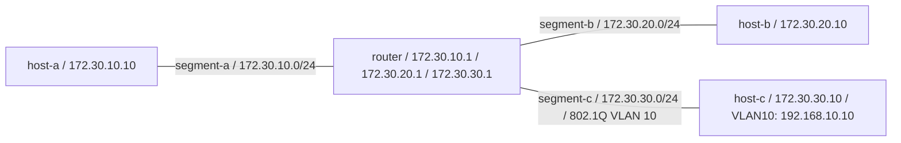

# L2 / L3 切り分けラボ（静的ルーティングと VLAN）

「つながらない」を **L1 → L2 → L3 → L4 → L7** の順に切り分ける練習用のラボ。

既存の [`labs/network-troubleshooting`](../network-troubleshooting/README.md) は
Docker の bridge に経路を任せた 2 セグメント構成で、扱う層は L3 以上だった。
こちらは **default route を外し、経路を自分で書く**構成にして、
L2（VLAN、同一セグメント内の到達）と L3（ルーティング、転送）を分けて扱う。

## 構成



各ホストは **default route を持たない**。隣のセグメントへ届かせるには、
`router` を経由する経路を明示的に入れる必要がある。

## 実行

```bash
cd labs/routing
./run-drill.sh
```

### トポロジは自分で組む（Docker の network を使わない）

bridge・veth・network namespace を `topology.sh` が組み立てる。
Docker の network を使わないのは、実行を試みて成立しないことが分かったため。

1. router に各セグメントの `.1` を要求すると、Docker が bridge 自身へ割り当てる
   `.1` と衝突して起動できない。
2. Docker は endpoint ごとに
   `iptables -t raw -A PREROUTING -d <IP> ! -i <その bridge> -j DROP` を入れる。
   別セグメントから router 宛に来たパケットは **FORWARD へ届く前に落ちる**。
3. コンテナ内の `/proc/sys` が read-only で `ip_forward` を切り替えられない。

権限は privileged なコンテナ 1 台へ閉じてあるので、host 側のネットワークには
何も残らない。後始末は `down` で済む。

### 前提: kernel の 802.1Q サポート

VLAN の演習（`B4-L2-02`〜`04`）は kernel の **802.1Q** サポートを使う。
無効な kernel では L3 の演習まで完走し、VLAN 分は `SKIP-ENV` として証跡に残す
（**PASS にはしない**。「確認していない」ことが分かる形にする）。

```bash
grep VLAN_8021Q /boot/config-$(uname -r)
```

## 演習内容

| ID | 層 | 再現する状況 | 見えるもの |
| --- | --- | --- | --- |
| B4-L2-01 | L2 | 同一セグメント内 | 経路が無くても届く |
| B4-L3-01 | L3 | 経路未設定 | 隣のセグメントへ届かない |
| B4-L3-02 | L3 | 静的ルート追加 | 届く。`traceroute` に router が 1 ホップ現れる |
| B4-L3-03 | L3 | **戻りの経路だけ削除** | 行きは通るが応答が返らない |
| B4-L3-04 | L3 | **`ip_forward=0`** | 両端の経路表は正しいのに通らない |
| B4-L3-05 | L3 | `ip_forward=1` に戻す | 復旧 |
| B4-L2-02 | L2 | VLAN 10 どうし | 疎通する |
| B4-L2-03 | L2 | **片側だけ VLAN 20** | IP / subnet / link state はすべて正常なのに通らない |
| B4-L2-04 | L2 | VLAN ID を揃える | 復旧 |

太字の 3 つがこのラボの主目的。いずれも
**「端末側の情報だけを見ていても原因にたどり着けない」**状況で、
実際の現場で時間を溶かしやすいパターン。

- `B4-L3-03`: 行きだけ見て「経路は正しい」と判断すると詰まる。
- `B4-L3-04`: 両端は正常。中継機器の設定を見に行く必要がある。
- `B4-L2-03`: L3 の情報が全部正常なので、VLAN ID を見るまで分からない。

結果は `docs/drills/logs/<日付>-B-4.md` に自動で書き出される。

## 手で触る場合

```bash
docker compose up -d
docker compose exec netlab sh /opt/topology.sh build

# 各 "ホスト" は network namespace なので netns 越しに触る
docker compose exec netlab ip netns list

# 経路を見る
docker compose exec netlab ip netns exec host-a ip route show
docker compose exec netlab ip netns exec host-a traceroute -n 172.30.20.10

# パケットを router 側で観察する
docker compose exec netlab ip netns exec router tcpdump -nn -i any icmp

# VLAN サブインターフェースの ID を確認する
docker compose exec netlab ip netns exec host-c ip -d link show
```

## 後始末

```bash
docker compose -f labs/routing/compose.yaml down
```

## このラボの範囲外

- Linux の network namespace 上の再現であり、**物理スイッチ、ケーブル、
  ポート VLAN の設定、bonding / LACP、スパニングツリーは扱わない**。
- 動的ルーティング（OSPF / BGP）は扱わない。静的ルートのみ。
- IPv6、NAT、ファイアウォール機器は扱わない。
- 実機スイッチの設定（Cisco IOS 等）は CCNA 学習と Packet Tracer 側で補う。
