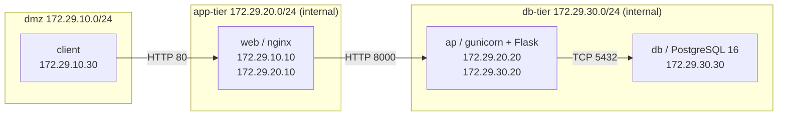

# Web / AP / DB 3 層構成ラボ

空の環境から Web・AP・DB を分けて構築し、**層をまたぐ障害の切り分け**と
**データベースの復元**を実測するためのラボ。

`server-monitor` 本体は監視基盤（Prometheus / Grafana / Loki）が主題なので、
「アプリケーション基盤としての 3 層構成」と「DB の復元試験」はこちらで扱う。

## 構成



設計上の要点は **web が `db-tier` ネットワークに参加していない**こと。
「設定として書いてある」だけでは意味がないので、ドリルの `B2-02` で
web から db へ実際に到達できないことを毎回確認する。

| 層 | 役割 | 生存確認 | DB を見るか |
| --- | --- | --- | --- |
| web (nginx) | 入口、リバースプロキシ | `GET /web-healthz` | 見ない |
| ap (gunicorn + Flask) | 業務ロジック、DB 接続 | `GET /healthz` | 見ない |
| ap (同上) | 依存先込みの可否 | `GET /readyz` | 見る |
| db (PostgreSQL 16) | データ保持 | `pg_isready` | — |

`/healthz`（プロセス生存）と `/readyz`（依存先込み）を分けているのが肝で、
これを 1 つにまとめてしまうと「AP が落ちた」と「DB が落ちた」を
HTTP status だけでは区別できなくなる。

## 起動

```bash
cd labs/three-tier
docker compose up -d --build
docker compose exec -T client curl -fsS http://web/
```

| 確認 | コマンド |
| --- | --- |
| Web 層の生存 | `docker compose exec -T client curl -i http://web/web-healthz` |
| AP 層の生存 | `docker compose exec -T client curl -i http://web/healthz` |
| AP + DB の可否 | `docker compose exec -T client curl -i http://web/readyz` |
| データ件数 | `docker compose exec -T client curl -s http://web/api/items/count` |

## B-2: 障害切り分け演習

```bash
./run-drill.sh
```

3 種類の障害を注入し、層ごとの応答から原因を絞り込む。

| 障害 | 注入内容 | 観測される並び | 原因の層 |
| --- | --- | --- | --- |
| A | DB プロセス停止 | web-healthz 200 / healthz 200 / readyz 503 | DB |
| B | AP プロセス停止 | web-healthz 200 / トップ 502 | AP |
| C | AP を db-tier から切断 | A と同じ並び | 経路 |

**A と C は AP から見た症状が同じ**。DB コンテナ自身の稼働状態と、
AP 側の所属ネットワーク・名前解決まで見て初めて区別できる。
「症状が同じなら原因も同じ」と決めつけないための演習。

結果は `docs/drills/logs/<日付>-B-2.md` に自動で書き出される。

## B-3: バックアップ・復元演習

```bash
./run-restore-drill.sh
```

`pg_dump` → バックアップ後の追記 → `DROP TABLE` → `pg_restore` の順で、
**論理バックアップからの復元**と **RTO / RPO の実測**を行う。

確認するのは次の 4 点。

1. 件数が戻ること
2. **内容ハッシュ**まで一致すること（件数だけでは中身の差を見逃す）
3. バックアップ後に入った行は戻らないこと（= RPO の実体）
4. アプリから 200 が返るところまで戻ること（DB を戻して終わりではない）

結果は `docs/drills/logs/<日付>-B-3.md` に自動で書き出される。

## 後始末

```bash
docker compose -f labs/three-tier/compose.yaml down -v
rm -rf labs/three-tier/.backups
```

## このラボの範囲外

- 単一ホスト上のコンテナ構成であり、物理的に分かれた 3 台のサーバー、
  L2 スイッチ、VLAN、ファイアウォール機器は扱わない
  （L2 / L3 は [`labs/routing`](../routing/README.md) が担当する）。
- DB のレプリケーション、フェイルオーバー、PITR は扱わない。
- 認証、TLS 終端、WAF は扱わない（本体の `server-monitor` 側が担当）。
- パスワードはラボ用の固定値をそのまま書いている。実ホストでは
  Docker secrets と Ansible Vault を使う（本体 `compose.yaml` / `ansible/` 参照）。
